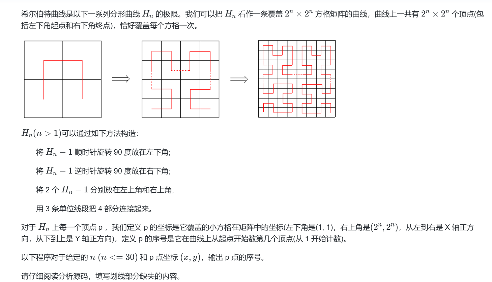
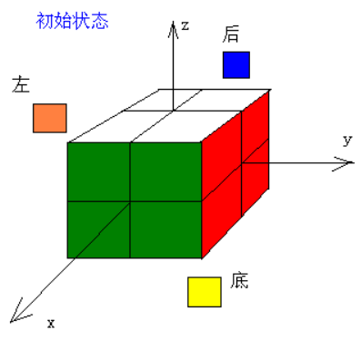
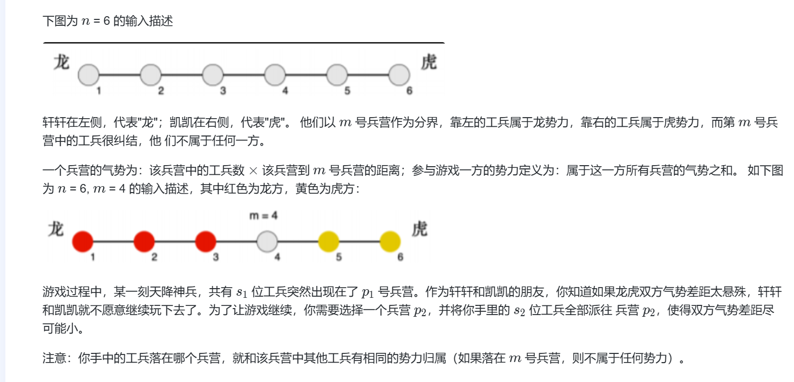
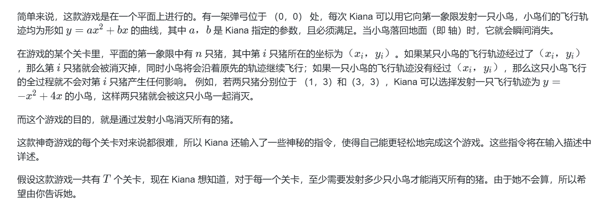

## 16届蓝桥杯备赛周练2
**<span style="font-size: 20px;">移动创新实验室</span>**
- **资料来源：<span style="font-size: 18px;">柴浩天</span>**
- **编辑者：<span style="font-size: 18px;">柴浩天</span>**
- **如有问题: <span style="font-size: 18px;">请在下方评论区留言或在工作日工作时间钉钉群提问</span>**

## 学习大纲
1. **习题一：乌托邦树**
   - 实现一个算法得到乌托邦树的高度。

2. **习题二：成绩**
   - 计算课程最终能得到多少分。

3. **习题三：花匠**

4. **习题四：接水问题**
   - 实现一个算法确定将一个二进制整数翻转为另一个二进制整数，需要翻转的位数。

5. **习题五：希尔伯特曲线**

6. **习题六：燃烧权杖**

7. **习题七：魔方旋转问题**

8. **习题八：龙虎斗**

9. **习题九：宝藏**

10. **习题十：愤怒的小鸟**

## 习题一：乌托邦树
**<span style="font-size: 20px;">实现一个算法得到乌托邦树的高度。介绍如下：
乌托邦树每年经历 2 个生长周期。每年春天，它的高度都会翻倍。每年夏天，它的高度都会增加 1 米。
对于一颗在春天开始时种下的高 1 米的树，问经过指定周期后，树的高度为多少。</span>**
- **资料来源：<span style="font-size: 18px;">柴浩天</span>**
- **参考答案：<span style="font-size: 12px;">答案并不唯一</span>**
``` java
import java.util.Scanner;

public class Main {
    public static void main(String[] args) {
        Scanner scan = new Scanner(System.in);
        int N = scan.nextInt(); // 输入指定周期数
        int height = 1; // 初始高度
        
        for (int cycle = 1; cycle <= N; cycle++) {
            if (cycle % 2 == 1) { // 奇数周期，即春天，树高翻倍
                height *= 2;
            } else { // 偶数周期，即夏天，树高加1米
                height += 1;
            }
        }
        
        System.out.println(height); // 输出最终高度
        scan.close();
    }
}
```
- **难度：<span style="font-size: 12px;">中等</span>**
- **测试用例通过比例：<span style="font-size: 12px;">3/3</span>**
- **内存：<span style="font-size: 12px;">41136KB</span>**
- **评测机制：<span style="font-size: 12px;">ACM</span>**
- **评测结果：：<span style="font-size: 12px;">通过</span>**


## 习题二：成绩
**<span style="font-size: 20px;">牛牛最近学习了 C++入门课程，这门课程的总成绩计算方法是：
总成绩 = 作业成绩 
×
× 20% + 小测成绩 
×
× 30% + 期末考试成绩 
×
× 50%
牛牛想知道，这门课程自己最终能得到多少分。
</span>**
- **资料来源：<span style="font-size: 18px;">柴浩天</span>**
- **参考答案：<span style="font-size: 12px;">答案并不唯一</span>**

``` java
import java.util.Scanner;

public class Main {
    public static void main(String[] args) {
        Scanner scan = new Scanner(System.in);
        
        // 读取输入的成绩
        int homeworkScore = scan.nextInt(); // 作业成绩
        int quizScore = scan.nextInt(); // 小测成绩
        int finalExamScore = scan.nextInt(); // 期末考试成绩
        
        // 计算总成绩
        double totalScore = homeworkScore * 0.2 + quizScore * 0.3 + finalExamScore * 0.5;
        
        // 输出总成绩，由于题目要求输出整数，这里使用Math.round进行四舍五入
        System.out.println(Math.round(totalScore));
        
        scan.close();
    }
}
```
- **难度：<span style="font-size: 12px;">中等</span>**
- **测试用例通过比例：<span style="font-size: 12px;">10/10</span>**
- **内存：<span style="font-size: 12px;">41144KB</span>**
- **评测机制：<span style="font-size: 12px;">ACM</span>**
- **评测结果：：<span style="font-size: 12px;">通过</span>**


## 习题三：花匠
**<span style="font-size: 20px;">
花匠栋栋种了一排花，每株花都有自己的高度。花儿越长越大，也越来越挤。栋栋决定把这排中的一部分花移走，将剩下的留在原地，使得剩下的花能有空间长大，同时，栋栋希望剩下的花排列得比较别致。 
。设当一部分花被移走后， 剩下的花的高度依次为 ℎ
1
,
ℎ
2
,
.
.
.
,
ℎ
𝑛设当一部分花被移走后， 剩下的花的高度依次为 
𝑔
1
,
𝑔
2
,
.
.
.
,
𝑔
𝑚
，则栋栋希望下面两个条件中至少有一个满足：
条件 A：对于所有的 $𝑖，𝑔{2𝑖} > 𝑔{2𝑖−1}
，且
，且𝑔{2𝑖} > 𝑔{2𝑖+1}$；
条件 B：对于所有的 $𝑖，𝑔{2𝑖} < 𝑔{2𝑖−1}
，且
，且𝑔{2𝑖} < 𝑔{2𝑖+1}$。
注意上面两个条件在 
m=1 时同时满足，当 
m>1时最多有一个能满足。
请问，栋栋最多能将多少株花留在原地。
</span>**
- **资料来源：<span style="font-size: 18px;">柴浩天</span>**
- **参考答案：<span style="font-size: 12px;">答案并不唯一</span>**

``` java
import java.util.Scanner;

public class Main {
    public static void main(String[] args) {
        Scanner scan = new Scanner(System.in);
        
        // 读取花的数量
        int n = scan.nextInt();
        int[] heights = new int[n];
        
        // 读取每株花的高度
        for (int i = 0; i < n; i++) {
            heights[i] = scan.nextInt();
        }
        scan.close();
        
        // 分别计算满足条件A和条件B的最大长度
        int up = 1, down = 1;
        for (int i = 1; i < n; i++) {
            if (heights[i] > heights[i - 1]) {
                up = down + 1;
            } else if (heights[i] < heights[i - 1]) {
                down = up + 1;
            }
        }
        
        // 输出结果
        System.out.println(Math.max(up, down));
    }
}

``` 

- **难度：<span style="font-size: 12px;">中等</span>**
- **测试用例通过比例：<span style="font-size: 12px;">5/5</span>**
- **内存：<span style="font-size: 12px;">61668KB</span>**
- **评测机制：<span style="font-size: 12px;">ACM</span>**
- **评测结果：：<span style="font-size: 12px;">通过</span>**

## 习题四：接水问题
**<span style="font-size: 20px;">学校里有一个水房，水房里一共装有 
m 个龙头可供同学们打开水，每个龙头每秒钟的供水量相等，均为 1。现在有 
n 名同学准备接水，他们的初始接水顺序已经确定。将这些同学按接水顺序从 1 到 
n编号，
i 号同学的接水量为 
w 
i
 。接水开始时，1 到 
m 号同学各占一个水龙头，并同时打开水龙头接水。当其中某名同学 
j 完成其接水量要求 
w 
i
后，下一名排队等候接水的同学 
k 马上接替 j 同学的位置开始接水。这个换人的过程是瞬间完成的，且没有任何水的浪费。即 
j 同学第 
x 秒结束时完成接水，则 
k 同学第 
x+1 秒立刻开始接水。若当前接水人数 
n’不足 
m，则只有 
n’个龙头供水，其它 
m−n’个龙头关闭。现在给出 
n 名同学的接水量，按照上述接水规则，问所有同学都接完水需要多少秒。
</span>**
- **资料来源：<span style="font-size: 18px;">柴浩天</span>**
- **参考答案：<span style="font-size: 12px;">答案并不唯一</span>**

``` java

import java.util.PriorityQueue;
import java.util.Scanner;

public class Main {
    public static void main(String[] args) {
        Scanner scan = new Scanner(System.in);
        
        // 读取学生人数n和水龙头数量m
        int n = scan.nextInt();
        int m = scan.nextInt();
        
        // 使用优先队列来存储每个水龙头当前正在接水的同学的剩余接水量
        PriorityQueue<Integer> pq = new PriorityQueue<>();
        
        // 读取每个学生的接水量并初始化前m个学生的剩余接水量到优先队列中
        for (int i = 0; i < n; i++) {
            int waterNeed = scan.nextInt();
            if (i < m) {
                pq.add(waterNeed);
            } else {
                // 当有超过m个学生时，处理换人过程
                int minWaterNeed = pq.poll(); // 完成接水的学生
                pq.add(minWaterNeed + waterNeed); // 新学生接替位置并加上新的接水量
            }
        }
        scan.close();
        
        // 计算总时间，即优先队列中最长的接水时间
        int totalTime = 0;
        while (!pq.isEmpty()) {
            totalTime = Math.max(totalTime, pq.poll());
        }
        
        // 输出结果
        System.out.println(totalTime);
    }
}
```

- **难度：<span style="font-size: 12px;">中等</span>**
- **测试用例通过比例：<span style="font-size: 12px;">5/5</span>**
- **内存：<span style="font-size: 12px;">50132KB</span>**
- **评测机制：<span style="font-size: 12px;">ACM</span>**
- **评测结果：：<span style="font-size: 12px;">通过</span>**

## 习题五：希尔伯特曲线
**<span style="font-size: 20px;">本题为代码补全填空题，请将题目中给出的源代码补全，并复制到右侧代码框中，选择对应的编译语言（C/Java）后进行提交。若题目中给出的源代码语言不唯一，则只需选择其一进行补全提交即可。复制后需将源代码中填空部分的下划线删掉，填上你的答案。提交后若未能通过，除考虑填空部分出错外，还需注意是否因在复制后有改动非填空部分产生错误。
</span>**


- **资料来源：<span style="font-size: 18px;">柴浩天</span>**
- **参考答案：<span style="font-size: 12px;"> m - y + 1</span>**
```
 m - y + 1
```
```  c
#include <stdio.h>

long long f(int n, int x, int y) {
    if (n == 0) return 1;
    int m = 1 << (n - 1);
    if (x <= m && y <= m) {
        return f(n - 1, y, x);
    }
    if (x > m && y <= m) {
        return 3LL * m * m + f(n - 1, ________________ , m * 2 - x + 1); //  填空
    }
    if (x <= m && y > m) {
        return 1LL * m * m + f(n - 1, x, y - m);
    }
    if (x > m && y > m) {
        return 2LL * m * m + f(n - 1, x - m, y - m);
    }
}

int main() {
    int n, x, y;
    scanf("%d %d %d", &n, &x, &y); 
    printf("%lld", f(n, x, y));

    return 0;
}

```
``` java
import java.util.Scanner;
    
public class Main {
    public static long f(int n, int x, int y) {
    if (n == 0) return 1;
        int m = 1 << (n - 1);
        if (x <= m && y <= m) {
                return f(n - 1, y, x);
        }
        if (x > m && y <= m) {
                return 3L * m * m + f(n - 1, ________________ , m * 2 - x + 1); //填空
        }
        if (x <= m && y > m) {
                return 1L * m * m + f(n - 1, x, y - m);
        }
        if (x > m && y > m) {
                return 2L * m * m + f(n - 1, x - m, y - m);
        }
    return -1;
    }
    public static void main(String[] args) {
        Scanner in = new Scanner(System.in);
          int n = in.nextInt();
    int x = in.nextInt();
    int y = in.nextInt();
        
        System.out.println(f(n, x, y));
    }
}
```


## 习题六燃烧权杖
**<span style="font-size: 20px;">小 C 最近迷上了一款游戏。现在，在游戏中，小 C 有一个英雄，生命值为 
x；敌人也有一个英雄，生命值为 
y。除此以外，还有 
k 个士兵，生命值分别为 
a 1、a 2、......、a k
 。
现在小 C 打算使用一个叫做"燃烧权杖"的技能。"燃烧权杖"会每次等概率随机选择一个活着的角色（英雄或士兵），扣减其 10 点生命值，然后如果该角色的生命值小于或等于 0，则该角色死亡，不会再被"燃烧权杖"选中。"燃烧权杖"会重复做上述操作，直至任意一名英雄死亡。
小 C 想知道使用"燃烧权杖"后敌方英雄死亡（即，小 C 的英雄存活）的概率。为了避免精度误差，你只需要输出答案模一个质数 
p 的结果，具体见输出描述。
</span>**
- **资料来源：<span style="font-size: 18px;">个人博客</span>**
- **参考答案：<span style="font-size: 12px;">答案并不唯一</span>**

``` c++

#include <iostream>
using namespace std;

long long ckkp(long long n, long long i, long long p, long long *pa, long long *pb, int* pz) {
	long long a = *pa;
	long long b = *pb;
	int z = *pz;
	if (i == -1)return 1;
	int _a = (n - i) % p;
	int _b = (i + 1) % p;
	if (_a == 0) {
		z++;
		_a = (n - i) / p;
		while (_a%p == 0) {
			z++;
			_a /= p;
		}
	}
	if (_b == 0) {
		z--;
		_b = (i + 1) / p;
		while (_b%p == 0) {
			z--;
			_b /= p;
		}
	}
	a *= _a;//同余优化
	b *= _b;
	a %= p;
	b %= p;

	*pa = a;
	*pb = b;
	*pz = z;
	if (z > 0)return 0;
	if (z < 0)throw 0;
	while (a%b)
	{
		a += p;
	}
	return a / b;
}
int main() {
	long long t;
	cin >> t;
	long long temp;
	long long result;
	long long x, y, p, k;
	long long fc;
	for (long long i = 0; i < t; i++) {
		cin >> x >> y >> p >> k;
		for (long long j = 0; j < k; j++) {
			cin >> temp;
		}
		x = x / 10 + ((x % 10 > 0) ? 1 : 0);
		y = y / 10 + ((y % 10 > 0) ? 1 : 0);

		fc = x + y - 1;

		long long po = 1;//2^n

		for (long long i = 0; i < fc; i++)
		{
			po = po * 2 % p;
		}

		long long gc = 0;

		long long preA = 1, preB = 1;
		int __z = 0;
		for (long long i = 0; i < x; i++)
		{
			long long h = ckkp(fc, i - 1, p, &preA, &preB, &__z);
			gc += h;
			gc %= p;
		}

		for (long long i = 0; i < p; i++)
		{
			long long test = (i * po) % p;
			if (test == gc) {
				result = i;
				break;
			}
		}
		cout << result << endl;
	}
}
//：这个题目更像硬解RSA

```

## 习题七：魔方旋转问题
**<span style="font-size: 20px;">
魔方可以对它的 6 个面自由旋转。我们来操作一个 2 阶魔方（如下所示）：
</span>**


**<span style="font-size: 20px;">为了描述方便，我们为它建立了坐标系。
各个面的初始状态如下：
x 轴正向：绿
x 轴反向：蓝
y 轴正向：红
y 轴反向：橙
z 轴正向：白
z 轴反向：黄
假设我们规定，只能对该魔方进行 3 种操作。分别标记为：
x 表示在 x 轴正向做顺时针旋转;
y 表示在 y 轴正向做顺时针旋转;
z 表示在 z 轴正向做顺时针旋转;
xyz 则表示顺序执行 x,y,z 3 个操作。</span>**
- **资料来源：<span style="font-size: 18px;">csdn</span>**
- **参考答案：<span style="font-size: 12px;">答案并不唯一</span>**

``` c++
#include<bits/stdc++.h>
using namespace std;
struct cube{
	string x,y,z;
};
cube a[2][2][2]; 
int main()
{
	for(int i=0;i<2;i++)
		for(int j=0;j<2;j++)
			a[1][i][j].x="绿";
	for(int i=0;i<2;i++)
		for(int j=0;j<2;j++)
			a[i][1][j].y="红";
	for(int i=0;i<2;i++)
		for(int j=0;j<2;j++)
			a[i][j][1].z="白";
	for(int i=0;i<2;i++)
		for(int j=0;j<2;j++)
			a[0][i][j].x="蓝";
	for(int i=0;i<2;i++)
		for(int j=0;j<2;j++)
			a[i][0][j].y="橙";
	for(int i=0;i<2;i++)
		for(int j=0;j<2;j++)
			a[i][j][0].z="黄";
	string s;
	cin>>s;
	for(int i=0;i<s.length();i++)
	{
		if(s[i]=='x')
		{
			swap(a[1][1][1],a[1][1][0]);
			swap(a[1][1][1],a[1][0][0]);
			swap(a[1][1][1],a[1][0][1]);
			for(int i=0;i<2;i++)
				for(int j=0;j<2;j++)
						swap(a[1][i][j].y,a[1][i][j].z);
		}
		else if(s[i]=='y')
		{
			swap(a[1][1][1],a[0][1][1]);
			swap(a[1][1][1],a[0][1][0]);
			swap(a[1][1][1],a[1][1][0]);
			for(int i=0;i<2;i++)
				for(int j=0;j<2;j++)
						swap(a[i][1][j].z,a[i][1][j].x);
		}
		else if(s[i]=='z')
		{
			swap(a[1][1][1],a[1][0][1]);
			swap(a[1][1][1],a[0][0][1]);
			swap(a[1][1][1],a[0][1][1]);
			for(int i=0;i<2;i++)
				for(int j=0;j<2;j++)
						swap(a[i][j][1].x,a[i][j][1].y);
		}
	}
	cout<<a[1][1][1].x<<a[1][1][1].y<<a[1][1][1].z;
	return 0;
}
```
## 习题八：龙虎斗
**<span style="font-size: 20px;">
轩轩和凯凯正在玩一款叫《龙虎斗》的游戏，游戏的棋盘是一条线段，线段上有 
n 个兵营（自左至右编号 1 ~ 
n），相邻编号的兵营之间相隔 1 厘米，即棋盘为长度为 
n − 1 厘米的线段。
i 号兵营里有 
c
i位工兵。
</span>**


- **资料来源：<span style="font-size: 18px;">c语言网</span>**
- **参考答案：<span style="font-size: 12px;">答案并不唯一</span>**

``` c++
 #include<bits/stdc++.h>
using namespace std;
int main(){
    long long int a[100010],tiger=0,dragon=0,min=1000000,x,s1,s2,index=0;
    int n,m,p1,p2;
    cin>>n;
    for(int i=1;i<=n;i++){
        cin>>a[i];
    }
    cin>>m>>p1>>s1>>s2;
    a[p1]+=s1;
    for(int i=1;i<=n;i++){
        if(i>m){
            tiger+=a[i]*(i-m);
        }else if(i<m){
            dragon+=a[i]*(m-i);
        }
    }
    min=labs(dragon-tiger);
    if(dragon>tiger){
        p2=m;
        for(int i=m+1;i<=n;i++){
            x=s2*(i-m);
            index=labs(dragon-(tiger+x));
            if(index<min){
                min=index;
                p2=i;
            }
        }
    }else if(dragon==tiger){
        p2=m;
    }else if(dragon<tiger){
        p2=m;
        for(int i=1;i<m;i++){
            x=s2*(m-i);
            index=labs(tiger-(dragon+x));
            if(index<min){
                min=index;
                p2=i;
            }
        }
    }
    cout<<p2;
    return 0;
}
```
## 习题九：宝藏
**<span style="font-size: 20px;">
参与考古挖掘的小明得到了一份藏宝图，藏宝图上标出了 
n 个深埋在地下的宝藏屋，也给出了这 
n 个宝藏屋之间可供开发的 
m 条道路和它们的长度。
小明决心亲自前往挖掘所有宝藏屋中的宝藏。但是，每个宝藏屋距离地面都很远，也就是说，从地面打通一条到某个宝藏屋的道路是很困难的，而开发宝藏屋之间的道路则相对容易很多。
小明的决心感动了考古挖掘的赞助商，赞助商决定免费赞助他打通一条从地面到某个宝藏屋的通道，通往哪个宝藏屋则由小明来决定。
在此基础上，小明还需要考虑如何开凿宝藏屋之间的道路。已经开凿出的道路可以任意通行不消耗代价。每开凿出一条新道路，小明就会与考古队一起挖掘出由该条道路所能到达的宝藏屋的宝藏。另外，小明不想开发无用道路，即两个已经被挖掘过的宝藏屋之间的道路无需再开发。
新开发一条道路的代价是：
B×C。其中，
B 表示这条道路的长度，
C 表示从赞助商帮你打通的宝藏屋到这条道路起点的宝藏屋所经过的宝藏屋的数量（包括赞助商帮你打通的宝藏屋和这条道路起点的宝藏屋）。
请你编写程序为小明选定由赞助商打通的宝藏屋和之后开凿的道路，使得工程总代价最小，并输出这个最小值。
</span>**
- **资料来源：<span style="font-size: 18px;">csdn</span>**
- **参考答案：<span style="font-size: 12px;">答案并不唯一</span>**

``` 
#include <iostream>
#include <cstring>
using namespace std;

const int N = 12, M = 1 << N, INF = 0x3f3f3f3f;
//g[i][state]表示点i到集合state的最小长度
int w[N][N], g[N][M];
//f[state][i]表示当前生成树状态为state、并且树的深度为i时，工程总代价的最小值
int f[M][N];
int main()
{
    int n, m;
    cin >> n >> m;
    memset(w, 0x3f, sizeof w);
    while(m --)
    {
        int a, b, c;
        cin >> a >> b >> c;
        //点的编号从0开始，以便处理点集
        a --, b --;
        //有重边，所以取最小值
        w[a][b] = w[b][a] = min(w[a][b], c);
    }
    //预处理任一点到所有集合的最小长度
    memset(g, 0x3f, sizeof g);
    for(int i = 0; i < n; i ++)
        for(int state = 0; state < 1 << n; state ++)
            //枚举state中的点
            for(int k = 0; k < n; k ++)
                if(state >> k & 1)
                    //更新i到集合state长度的最小值
                    g[i][state] = min(g[i][state], w[i][k]); 
    //初始状态
    memset(f, 0x3f, sizeof f);
    //以i点为起点到达深度0的最小代价为0
    for(int i = 0; i < n; i ++) f[1 << i][0] = 0;
    //状态计算
    for(int state = 1; state < 1 << n; state ++)
    {
        //枚举state的子集s
        for(int s = state - 1 & state; s != 0; s = s - 1 & state)
        {
            //t表示前i-1层的点集状态
            int t = state ^ s, L = 0;
            //枚举第i层所有点，计算第i层的所有点到第i-1层的最小长度之和L
            for(int k = 0; k < n; k ++)
            {
                if(s >> k & 1) //点k在第i层的集合中
                {
                    L += g[k][t]; //累加最后一层所有点到上一层的长度
                    if(L >= INF) break; //点k到不了第i-1层的所有点
                }
            }
            
            if(L >= INF) continue; //子集s中存在点无法到达第i-1层
            //枚举深度，计算当前状态f[state][i]
            for(int i = 1; i < n; i ++)
                f[state][i] = min(f[state][i], f[t][i - 1] + L * i);
        }
    }
    //结果为包含所有宝藏屋时，对于不同深度的生成树取最小值
    int ans = INF;
    for(int i = 0; i < n; i ++)
        ans = min(ans, f[(1 << n) - 1][i]);
    cout << ans;
    return 0;
}
```

## 习题十：愤怒的小鸟
**<span style="font-size: 20px;">
Kiana 最近沉迷于一款神奇的游戏无法自拔。
</span>**


- **资料来源：<span style="font-size: 18px;">csdn</span>**
- **参考答案：<span style="font-size: 12px;">答案并不唯一</span>**

```  c++
#include <iostream>
#include <cmath>
#include <cstring>
using namespace std;

typedef pair<double, double> PDD;
const int N = 18;
const double eps = 1e-6;
int n, m;
PDD p[N];
//path[i][j]表示覆盖i、j点时的曲线集合
int path[N][N];
int f[1 << N];

int cmp(double a, double b)
{
    if(fabs(a - b) < eps) return 0;
    if(a > b) return 1;
    else return -1;
}

int main()
{
    int T;
    cin >> T;
    while(T --)
    {
        //输入点的信息
        cin >> n >> m;
        for(int i = 0; i < n; i ++) cin >> p[i].first >> p[i].second;
        
        memset(path, 0, sizeof path);
        //预处理经过所有的点的曲线，以及曲线经过的点的集合
        for(int i = 0; i < n; i ++)
        {
            path[i][i] = 1 << i; //只经过i点的曲线
            for(int j = 0; j < n; j ++)
            {
                //计算点i、j的曲线系数a、b
                double x1 = p[i].first, y1 = p[i].second;
                double x2 = p[j].first, y2 = p[j].second;
                //注意：如果i、j两点不能在同一列
                if(cmp(x1, x2) == 0) continue;
                
                double a = (y1 / x1 - y2 / x2) / (x1 - x2);
                double b = y1 / x1 - a * x1;
                
                if(cmp(a, 0) >= 0) continue; //曲线必须开口向下
                
                //枚举所有点，计算曲线a、b所能覆盖的点的集合state
                int state = 0;
                for(int k = 0; k < n; k ++)
                {
                    double x = p[k].first, y = p[k].second;
                    //如果点(x,y)在曲线ab上
                    if(!cmp(a * x * x + b * x, y))
                    {
                        state += 1 << k; //将k点纳入到曲线ab所能覆盖的点的集合中
                    }
                }
                //点i、j所确定的曲线能够覆盖的点的集合为state
                path[i][j] = state; 
            }
        }
        
        //初始状态
        memset(f, 0x3f, sizeof f);
        f[0] = 0;
        
        //状态计算，注意到已经包含所有列时，就不需要再计算了
        for(int state = 0; state + 1 < 1 << n; state ++)
        {
            //找到任意一个不在state中的列x
            int x = 0;
            for(int i = 0; i < n; i ++)
            {
                //i点不在state中的列x
                if((state >> i & 1) == 0)
                {
                    x = i;
                    break;
                }
            }
            //枚举所有点，计算覆盖x点的新状态state | path[x][j]的最优解
            for(int i = 0; i < n; i ++)
            {
                f[state | path[x][i]] = min(f[state | path[x][i]], f[state] + 1);
            }
        }
        //最终答案，覆盖所有点时的最优解
        cout << f[(1 << n) - 1] << endl;
    }
    return 0;
}

```

<VisitorPanel />