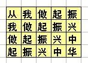
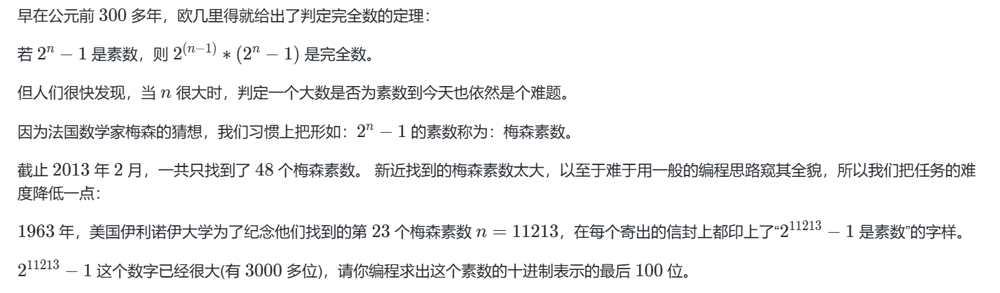
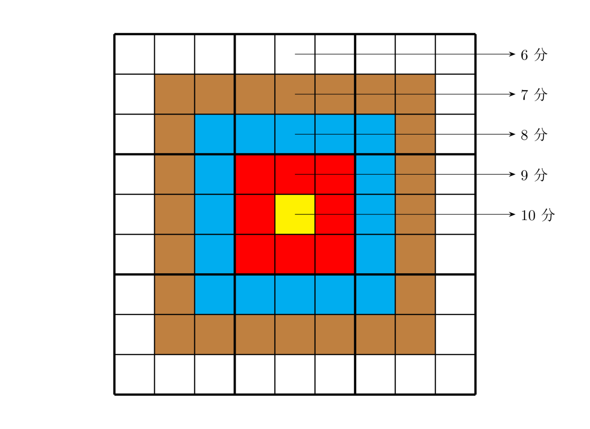
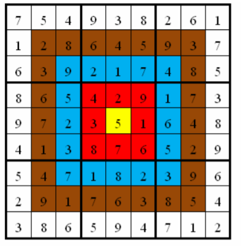

## 16届蓝桥杯备赛周练3
**<span style="font-size: 20px;">移动创新实验室</span>**
- **资料来源：<span style="font-size: 18px;">柴浩天</span>**
- **编辑者：<span style="font-size: 18px;">柴浩天</span>**
- **如有问题: <span style="font-size: 18px;">请在下方评论区留言或在工作日工作时间钉钉群提问</span>**
## 学习大纲
1. **习题一：第几天**
   - 本题为填空题，只需要算出结果后，在代码中使用输出语句将所填结果输出即可。

2. **习题二：一步之遥**
   - 本题为填空题，只需要算出结果后，在代码中使用输出语句将所填结果输出即可。

3. **习题三：奖券数目**
   - 本题为填空题，只需要算出结果后，在代码中使用输出语句将所填结果输出即可。

4. **习题四：隔行变色**
   - 本题为填空题，只需要算出结果后，在代码中使用输出语句将所填结果输出即可。

5. **习题五：熊怪吃核桃**
   - 本题为填空题，只需要算出结果后，在代码中使用输出语句将所填结果输出即可。

6. **习题六：振兴中华**
   - 本题为填空题，只需要算出结果后，在代码中使用输出语句将所填结果输出即可。

7. **习题七：世纪末的星期**
   - 本题为填空题，只需要算出结果后，在代码中使用输出语句将所填结果输出即可。

8. **习题八：梅森素数**
   - 本题为填空题，只需要算出结果后，在代码中使用输出语句将所填结果输出即可。

9. **习题九：靶形数独**
   - 小城和小华都是热爱数学的好学生，最近，他们不约而同地迷上了数独游戏，好胜的他们想用数独来一比高低。但普通的数独对他们来说都过于简单了，于是他们向 Z 博士请教，Z 博士拿出了他最近发明的“靶形数独”，作为这两个孩子比试的题目。

10. **习题十：采药**
   - 辰辰是个天资聪颖的孩子，他的梦想是成为世界上最伟大的医师。为此，他想拜附近最有威望的医师为师。医师为了判断他的资质，给他出了一个难题。医师把他带到一个到处都是草药的山洞里对他说：“孩子，这个山洞里有一些不同的草药，采每一株都需要一些时间，每一株也有它自身的价值。我会给你一段时间，在这段时间里，你可以采到一些草药。如果你是一个聪明的孩子，你应该可以让采到的草药的总价值最大。”

## 习题一：第几天
**<span style="font-size: 20px;">2000 年的 1 月 1 日，是那一年的第1 天。那么，2000年的 5 月 4日，是那一年的第几天？
</span>**
- **资料来源：<span style="font-size: 18px;">柴浩天</span>**
- **参考答案：<span style="font-size: 12px;">答案并不唯一</span>**

``` java
import java.util.Scanner;
// 1:无需package
// 2: 类名必须Main, 不可修改

public class Main {
    public static void main(String[] args) {
        // 给定日期信息，虽然题目已经明确了具体日期，这里还是按照您的代码结构进行
        int year = 2000;
        int month = 5;
        int day = 4;
        // 计算给定日期是这一年的第几天
        int dayOfYear = calculateDayOfYear(year, month, day);
        // 输出结果
        System.out.println(dayOfYear);
        // 关闭scanner，尽管在这个示例中并没有使用它来接收输入
        Scanner scan = new Scanner(System.in);
        scan.close();
    }
    private static int calculateDayOfYear(int year, int month, int day) {
        // 判断是否为闰年
        boolean isLeapYear = (year % 4 == 0 && year % 100 != 0) || (year % 400 == 0);
        // 每个月的天数，考虑闰年情况下2月的天数
        int[] monthLengths = {31, isLeapYear ? 29 : 28, 31, 30, 31, 30, 31, 31, 30, 31, 30, 31};       
        int dayOfYear = 0;
        for (int i = 0; i < month - 1; i++) {
            dayOfYear += monthLengths[i];
        }
        dayOfYear += day;
        return dayOfYear;
    }
}
```

- **难度：<span style="font-size: 12px;">中等</span>**
- **测试用例通过比例：<span style="font-size: 12px;">1/1</span>**
- **内存：<span style="font-size: 12px;">40576KB</span>**
- **评测机制：<span style="font-size: 12px;">ACM</span>**
- **评测结果：：<span style="font-size: 12px;">通过</span>**

## 习题二：一步之遥
**<span style="font-size: 20px;">从昏迷中醒来，小明发现自己被关在 X 星球的废矿车里。 矿车停在平直的废弃的轨道上。 他的面前是两个按钮，分别写着 “F” 和 “B” 。
小明突然记起来，这两个按钮可以控制矿车在轨道上前进和后退。 按 F，会前进 97 米。按 B 会后退127 米。 透过昏暗的灯光，小明看到自己前方 1 米远正好有个监控探头。 他必须设法使得矿车正好停在摄像头的下方，才有机会争取同伴的援助。 或许，通过多次操作 F 和B 可以办到。矿车上的动力已经不太足，黄色的警示灯在默默闪烁... 每次进行 F或 B 操作都会消耗一定的能量。 小明飞快地计算，至少要多少次操作，才能把矿车准确地停在前方 1 米远的地方。请问为了达成目标，最少需要操作的次数是多少。
</span>**
- **资料来源：<span style="font-size: 18px;">柴浩天</span>**
- **参考答案：<span style="font-size: 12px;">答案并不唯一</span>**

``` java    
import java.util.HashSet;
import java.util.LinkedList;
import java.util.Queue;

public class Main {
    public static void main(String[] args) {
        // 定义前进和后退的距离
        int forward = 97;
        int backward = -127;
        // 目标位置
        int target = 1;
        // 已访问的位置，避免重复访问
       HashSet<Integer> visited = new HashSet<>();
        // 队列用于BFS
        Queue<Node> queue = new LinkedList<>();
        // 初始化队列，从位置0开始
        queue.offer(new Node(0, 0)); // (当前位置, 步数)
        visited.add(0);        

        while (!queue.isEmpty()) {
            Node current = queue.poll();
            // 如果当前位置加上前进距离正好到达目标
            if ((current.position + forward - target) == 0 || (current.position + backward - target) == 0) {
                System.out.println(current.steps +  1); // 输出最少步数
                return;
            }       
            // 尝试前进并检查是否已访问
            int newPositionForward = current.position + forward;
            if (!visited.contains(newPositionForward)) {
                queue.offer(new Node(newPositionForward, current.steps + 1));
                visited.add(newPositionForward);
            }      
            // 尝试后退并检查是否已访问
          int newPositionBackward = current.position + backward;
            if (!visited.contains(newPositionBackward)) {
                queue.offer(new Node(newPositionBackward, current.steps + 1));
                visited.add(newPositionBackward);
            }
        }
    }
    // 辅助类，用于存储当前的位置和到达此位置所需步数
    static class Node {
        int position;
        int steps;
        Node(int pos, int step) {
            this.position = pos;
            this.steps = step;
        }
    }
}
```
- **难度：<span style="font-size: 12px;">中等</span>**
- **测试用例通过比例：<span style="font-size: 12px;">1/1</span>**
- **内存：<span style="font-size: 12px;">38308KB</span>**
- **评测机制：<span style="font-size: 12px;">ACM</span>**
- **评测结果：：<span style="font-size: 12px;">通过</span>**


## 习题三：奖券数目
**<span style="font-size: 20px;">
有些人很迷信数字，比如带 “4” 的数字，认为和“死”谐音，就觉得不吉利。 虽然这些说法纯属无稽之谈，但有时还要迎合大众的需求。某抽奖活动的奖券号码是 5 位数（10000−99999），要求其中不要出现带 “4” 的号码。主办单位请你计算一下，如果任何两张奖券不重号，最多可发出奖券多少张。
</span>**
- **资料来源：<span style="font-size: 18px;">柴浩天</span>**
- **参考答案：<span style="font-size: 12px;">答案并不唯一</span>**

``` java
public class Main {
    public static void main(String[] args) {
        // 计算不包含数字"4"的奖券数量
        int totalTickets = 8 * (int)Math.pow(9, 4);
        // 输出结果
        System.out.println(totalTickets);

    }
}
```

- **难度：<span style="font-size: 12px;">中等</span>**
- **测试用例通过比例：<span style="font-size: 12px;">1/1</span>**
- **内存：<span style="font-size: 12px;">37588KB</span>**
- **评测机制：<span style="font-size: 12px;">ACM</span>**
- **评测结果：：<span style="font-size: 12px;">通过</span>**

## 习题四：隔行变色
**<span style="font-size: 20px;">Excel 表的格子很多，为了避免把某行的数据和相邻行混淆，可以采用隔行变色的样式。小明设计的样式为：第 1 行蓝色，第 2 行白色，第 3 行蓝色，第 4 行白色 现在小明想知道，从第 21 行到第 50 行一共包含了多少个蓝色的行。
</span>**
- **资料来源：<span style="font-size: 18px;">柴浩天</span>**
- **参考答案：<span style="font-size: 12px;">答案并不唯一</span>**

``` java
public class Main {
    public static void main(String[] args) {
        // 定义起始行和结束行
        int start = 21;
        int end = 50;
        // 计算蓝色行的数量
        int blueRows = ((end - start) / 2) + (start % 2 != 0 ? 1 : 0);
        // 输出结果
        System.out.println(blueRows);
    }
}
```

- **难度：<span style="font-size: 12px;">中等</span>**
- **测试用例通过比例：<span style="font-size: 12px;">1/1</span>**
- **内存：<span style="font-size: 12px;">37556KB</span>**
- **评测机制：<span style="font-size: 12px;">ACM</span>**
- **评测结果：：<span style="font-size: 12px;">通过</span>**


## 习题五：熊怪吃核桃
**<span style="font-size: 20px;">森林里有一只熊怪，很爱吃核桃。不过它有个习惯，每次都把找到的核桃分成相等的两份，吃掉一份，留一份。如果不能等分，熊怪就会扔掉一个核桃再分。第二天再继续这个过程，直到最后剩一个核桃了，直接丢掉。有一天，熊怪发现了1543 个核桃，请问，它在吃这些核桃的过程中，一共要丢掉多少个核桃。
</span>**
- **资料来源：<span style="font-size: 18px;">柴浩天</span>**
- **参考答案：<span style="font-size: 12px;">答案并不唯一</span>**

``` java
public class Main {
    public static void main(String[] args) {
        int walnuts = 1543; // 初始核桃数量
        int discarded = 0; // 记录丢弃的核桃总数
        while (walnuts > 1) { // 当剩余核桃大于1时继续循环
           if (walnuts % 2 == 0) {
               walnuts /= 2; // 如果可以等分，则吃掉一半
            } else {
                walnuts -= 1; // 如果不能等分，则先丢弃一个核桃
                discarded += 1;
                walnuts /= 2; // 然后吃掉剩下的一半
            }
        }
        // 因为最后会剩下一个核桃直接丢弃，所以这里不需要额外增加丢弃计数
        // 因为无论最后一次操作是什么，最终都会剩下一个核桃被丢弃，
        // 这个逻辑已经在while循环之外自然解决了。
        // 输出最终丢弃的核桃总数
            discarded += 1;
        System.out.println(discarded);
    }
}
```

- **难度：<span style="font-size: 12px;">中等</span>**
- **测试用例通过比例：<span style="font-size: 12px;">1/1</span>**
- **内存：<span style="font-size: 12px;">37572KB</span>**
- **评测机制：<span style="font-size: 12px;">ACM</span>**
- **评测结果：：<span style="font-size: 12px;">通过</span>** 
 
## 习题六：振兴中华
**<span style="font-size: 20px;">小明参加了学校的趣味运动会，其中的一个项目是：跳格子。
地上画着一些格子，每个格子里写一个字，如下所示：
</span>**
 

**<span style="font-size: 20px;">
比赛时，先站在左上角的写着“从”字的格子里，可以横向或纵向跳到相邻的格子里，但不能跳到对角的格子或其它位置。一直要跳到“华”字结束。
要求跳过的路线刚好构成“从我做起振兴中华”这句话。
请你帮助小明算一算他一共有多少种可能的跳跃路线呢？
</span>**
- **资料来源：<span style="font-size: 18px;">柴浩天</span>**
- **参考答案：<span style="font-size: 12px;">答案并不唯一</span>**

``` java
public class Main {
    // 定义地图
    static char[][] map = {
        {'从', '我', '做', '起', '振'},

        {'我', '做', '起', '振', '兴'},

        {'做', '起', '振', '兴', '中'},

        {'起', '振', '兴', '中', '华'}

    };

    // 方向数组，表示可以移动的方向：右、下
    static int[][] directions = {{0, 1}, {1, 0}};
    static int count = 0;
    public static void main(String[] args) {
        String target = "从我做起振兴中华";
        dfs(0, 0, 0, target);
        System.out.println(count);

    }
    // 深度优先搜索函数
    private static void dfs(int x, int y, int index, String target) {
        // 边界条件和终止条件
        if (x < 0 || y < 0 || x >= map.length || y >= map[0].length || map[x][y] != target.charAt(index)) {
            return;
        }
        // 如果到达最后一个字符并且匹配
        if (index == target.length() - 1 && map[x][y] == target.charAt(index)) {
            count++;
            return;
        }

        // 尝试每个方向

        for (int[] d : directions) {

            dfs(x + d[0], y + d[1], index + 1, target);

        }
    }
}
```

- **难度：<span style="font-size: 12px;">中等</span>**
- **测试用例通过比例：<span style="font-size: 12px;">1/1</span>**
- **内存：<span style="font-size: 12px;">37564KB</span>**
- **评测机制：<span style="font-size: 12px;">ACM</span>**
- **评测结果：：<span style="font-size: 12px;">通过</span>**

## 习题七：世纪末的星期
**<span style="font-size: 20px;">
曾有邪教称 
1999 年 
12 月 
31 日是世界末日。当然该谣言已经不攻自破。
还有人称今后的某个世纪末的 
12 月 
31 日，如果是星期一则会....
有趣的是，任何一个世纪末的年份的 
12 月 
31 日都不可能是星期一!!
于是，“谣言制造商”又修改为星期日......
1999 年的 
12 月 
31 日是星期五，请问：未来哪一个离我们最近的一个世纪末年（即 xx99 年）的 
12 月31 日正好是星期天（即星期日）？
请回答该年份（只写这个 4 位整数，不要写 12 月 31 等多余信息）
</span>**
- **资料来源：<span style="font-size: 18px;">柴浩天</span>**
- **参考答案：<span style="font-size: 12px;">答案并不唯一</span>**

``` java
import java.time.LocalDate;
import java.time.temporal.ChronoField;
public class Main {

    public static void main(String[] args) {

        // 开始年份为下一个世纪末，即2099
        int year = 2099;
        
        while (true) {

            // 创建LocalDate对象表示该年份的12月31日

            LocalDate date = LocalDate.of(year, 12, 31);
            // 检查这一天是否为星期天

            if (date.get(ChronoField.DAY_OF_WEEK) == 7) { // 在java.time中，星期天被表示为7
                System.out.println(year);
                break;
            }
            // 如果不是，则跳到下一个世纪末

            year += 100;

        }

    }

}
```

- **难度：<span style="font-size: 12px;">中等</span>**
- **测试用例通过比例：<span style="font-size: 12px;">1/1</span>**
- **内存：<span style="font-size: 12px;">38232KB</span>**
- **评测机制：<span style="font-size: 12px;">ACM</span>**
- **评测结果：：<span style="font-size: 12px;">通过</span>**


## 习题八：梅森素数
**<span style="font-size: 20px;">
如果一个数字的所有真因子之和等于自身，则称它为“完全数”或“完美数”例如
</br>6 = 1 + 2 + 3 &nbsp;&nbsp;&nbsp;&nbsp
28 = 1 + 2 + 4 + 7 + 14
</span>**


- **资料来源：<span style="font-size: 18px;">柴浩天</span>**
- **参考答案：<span style="font-size: 12px;">答案并不唯一</span>**

``` java

import java.math.BigInteger;

public class Main {
    public static void main(String[] args) {
        // 计算2^11213
        BigInteger base = BigInteger.valueOf(2);
        BigInteger exponent = BigInteger.valueOf(11213);
        BigInteger result = base.modPow(exponent, BigInteger.TEN.pow(100)).subtract(BigInteger.ONE);
        
        // 确保结果为正数
        if (result.compareTo(BigInteger.ZERO) < 0) {
            result = result.add(BigInteger.TEN.pow(100));
        }
        
        // 格式化输出最后100位
        String formattedResult = String.format("%0100d", result);
        System.out.println(formattedResult);
    }
}
```

- **难度：<span style="font-size: 12px;">中等</span>**
- **测试用例通过比例：<span style="font-size: 12px;">1/1</span>**
- **内存：<span style="font-size: 12px;">40988KB</span>**
- **评测机制：<span style="font-size: 12px;">ACM</span>**
- **评测结果：：<span style="font-size: 12px;">通过</span>**

## 习题九：靶形数独
**<span style="font-size: 20px;">
小城和小华都是热爱数学的好学生，最近，他们不约而同地迷上了数独游戏，好胜的他们想用数独来一比高低。但普通的数独对他们来说都过于简单了，于是他们向 Z 博士请教，Z 博士拿出了他最近发明的“靶形数独”，作为这两个孩子比试的题目。靶形数独的方格同普通数独一样，在 9 格宽×9 格高的大九宫格中有 9 个 3 格宽 × 3 格高的小九宫格（用粗黑色线隔开的）。在这个大九宫格中，有一些数字是已知的，根据这些数字，利用逻辑推理，在其他的空格上填入 1 到 9 的数字。每个数字在每个小九宫格内不能重复出现，每个数字在每行、每列也不能重复出现。但靶形数独有一点和普通数独不同，即每一个方格都有一个分值，而且如同一个靶子一样，离中心越近则分值越高。（如下图）
</span>**


**<span style="font-size: 20px;">上图具体的分值分布是：最里面一格（黄色区域）为 10 分，黄色区域外面的一圈（红色区域）每个格子为 9 分，再外面一圈（蓝色区域）每个格子为 8 分，蓝色区域外面一圈（棕色区域）每个格子为 7 分，最外面一圈（白色区域）每个格子为 6 分，如上图所示。比赛的要求是：每个人必须完成一个给定的数独（每个给定数独可能有不同的填法），而且要争取更高的总分数。而这个总分数即每个方格上的分值和完成这个数独时填在相应格上的数字的乘积的总和。如下图，在以下的这个已经填完数字的靶形数独游戏中，总分数为 2829。游戏规定，将以总分数的高低决出胜负。</span>**


**<span style="font-size: 20px;">由于求胜心切，小城找到了善于编程的你，让你帮他求出，对于给定的靶形数独，能够得到的最高分数。</span>**
- **资料来源：<span style="font-size: 18px;">柴浩天</span>**
- **参考答案：<span style="font-size: 12px;">答案并不唯一</span>**

```  c++
#java代码循环内存占用过大，无法通过acm测试，只能用网上找的c++代码了
#include <iostream>
using namespace std;
const int N = 9, M = 1 << N;
int g[N][N];
int row[N], col[N], cell[3][3];
int ones[M]; //获取所有二进制形式中1的个数
int log[M]; //获取log(n)
int ans = -1;
//预处理每行每列每个小九宫格可选数字的状态
void init() 
{
    for(int i = 0; i < 9; i ++)
        row[i] = col[i] = (1 << 9) - 1;
    for(int i = 0; i < 3; i ++)
        for(int j = 0; j < 3; j ++)
            cell[i][j] = (1 << 9) - 1;
}
void fill(int x, int y, int t, bool is_set)
{
    int s = 1 << (t - 1); //要改变的状态，状态从0开始，所以要减1
    if(is_set) //填数
    {
        g[x][y] = t;
        //填完数，该数的状态设为不可行
        row[x] -= s, col[y] -= s, cell[x/3][y/3] -= s; 
    }
    else //清空
    {
        g[x][y] = 0;
        //清空后，该数的状态设为可行
        row[x] += s, col[y] += s, cell[x/3][y/3] += s;
    }
}
//获取x行y列可选数字的状态
int get(int x, int y)
{
    return row[x] & col[y] & cell[x/3][y/3];
}
//获取x行y列填数字t的分数
int get_score(int x, int y, int t)
{
    return (min(min(x, 8 - x), min(y, 8 - y)) + 6) * t;
}
int lowbit(int x)  // 返回末尾的1
{
    return x & -x;
}
void dfs(int cnt, int score)
{
    if(cnt == 0) 
    {
        ans = max(ans, score);
        return; //全部填完
    }
    //优化搜索顺序，寻找可选数字最少的行列
    int minv = 10, x, y;
    for(int i = 0; i < 9; i ++)
        for(int j = 0; j < 9; j ++)
        {
            if(g[i][j] == 0)
            {
                int state = get(i, j);
                if(ones[state] < minv)
                {
                    minv = ones[state], x = i, y = j;
                }
            }
        }
    //从x行y列开始搜索
    int state = get(x, y); //从x行y列可选数字的状态
    for(int i = state; i != 0; i -= lowbit(i))
    {
        int t = log[lowbit(i)] + 1; //获取对应要填的数1~9，map中映射的是0~8，所以要+1
        fill(x, y, t, true);
        dfs(cnt - 1, score + get_score(x, y, t));
        fill(x, y, t, false); //回溯，恢复现场
    }
}
int main()
{
    init();
    //统计每个状态中1的个数
    for(int i = 0; i < 1 << 9; i ++)
        for(int j = 0; j < 9; j ++)
            ones[i] += i >> j & 1; 
    //预处理log(i)，方便快速获取要填的数字，注意预处理的是0~8
    for(int i = 0; i < 9; i ++) log[1 << i] = i;
    
    int cnt = 0, score = 0; //一共要填cnt个数
    for(int i = 0; i < 9; i ++)
        for(int j = 0; j < 9; j ++)
        {
            cin >> g[i][j];
            if(g[i][j] != 0) //数字已填
            {
                fill(i, j, g[i][j], true); //填数
                score += get_score(i, j, g[i][j]);
            }
            else cnt ++;
        }
    
    //暴力搜索，一共要填cnt个数，目前的分数为score
    dfs(cnt, score);
    cout << ans << endl;
}

```

## 习题十：采药
**<span style="font-size: 20px;">
辰辰是个天资聪颖的孩子，他的梦想是成为世界上最伟大的医师。为此，他想拜附近最有威望的医师为师。医师为了判断他的资质，给他出了一个难题。医师把他带到一个到处都是草药的山洞里对他说：“孩子，这个山洞里有一些不同的草药，采每一株都需要一些时间，每一株也有它自身的价值。我会给你一段时间，在这段时间里，你可以采到一些草药。如果你是一个聪明的孩子，你应该可以让采到的草药的总价值最大。”
如果你是辰辰，你能完成这个任务吗？
</span>**
- **资料来源：<span style="font-size: 18px;">柴浩天</span>**
- **参考答案：<span style="font-size: 12px;">答案并不唯一</span>**

``` java
import java.util.Scanner;

public class Main {
    public static void main(String[] args) {
        Scanner scan = new Scanner(System.in);
        
        // 读取输入
        int T = scan.nextInt(); // 总共能够用来采药的时间
        int M = scan.nextInt(); // 山洞里的草药的数目
        
        // 初始化dp数组，dp[i]表示在时间i时能获得的最大价值
        int[] dp = new int[T + 1];
        
        for (int i = 0; i < M; i++) {
            int time = scan.nextInt(); // 当前草药的采摘时间
            int value = scan.nextInt(); // 当前草药的价值
            
            // 对于每一种草药，从后向前更新dp数组
            for (int j = T; j >= time; j--) {
                dp[j] = Math.max(dp[j], dp[j - time] + value);
            }
        }
        
        // 输出最大价值
        System.out.println(dp[T]);
        
        scan.close();
    }
}
```

- **答案评分：<span style="font-size: 12px;">走丢了...</span>**


<VisitorPanel />