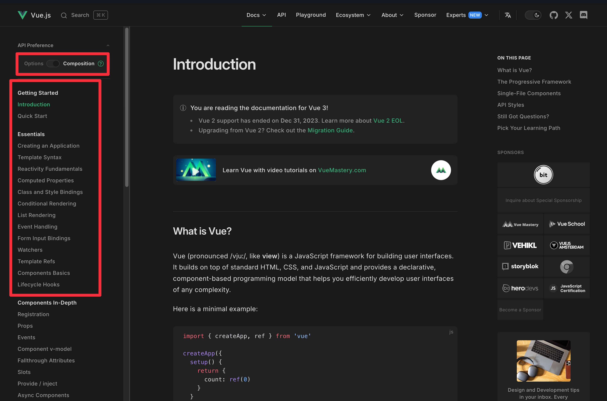
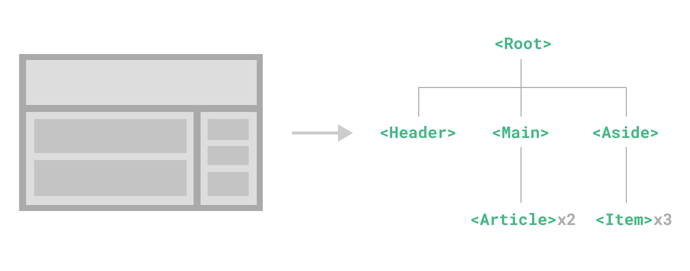

# Vue3

蓝桥杯Web组 省赛备赛

## Vue3

+ 模板语法
+ 响应式API
+ 生命周期API
+ 组件API

---

### Vue3学习最佳资源

官方文档：[Vue.js 官方文档](https://vuejs.org)



---

## 模板语法

Vue 使用基于 HTML 的模板语法，允许您**声明性**地将渲染的 DOM 绑定到底层组件实例的数据。所有 Vue 模板都是语法有效的 HTML，可以被符合规范的浏览器和 HTML 解析器解析。

### 1. 数据绑定

```vue
<template>
    <span>Message: {{ msg.toUpperCase() }}</span>
</template>
```

### 2. 属性绑定

```vue
<script setup>
import { ref } from 'vue'
const dynamicId = ref('foo')
</script>

<template>
    <span :id="dynamicId">Message: {{ msg }}</span>
</template>
```

### 3. 多属性绑定

```vue
<script setup>
import { ref } from 'vue'
const items = {
  foo: 'bar',
  baz: 42
}
</script>

<template>
  <div v-bind="items"></div>
</template>
```

### 4. 完整的指令语法


详见：[指令语法](https://vuejs.org/guide/essentials/template-syntax.html)

---

### 5. 条件渲染（操作DOM）

```vue
<template>
  <div v-if="awesome">Vue is awesome!</div>
  <div v-else>Oh no 😢</div>
</template>
```

### 6. 条件渲染（控制`display`）

```vue
<template>
  <div v-show="awesome">Vue is awesome!</div>
</template>
```

详见：[条件渲染](https://vuejs.org/guide/essentials/conditional.html)

### 7. 列表渲染

```vue
<template>
  <ul>
    <li v-for="item in items" :key="item.id">{{ item.text }}</li>
  </ul>
</template>
```

详见：[列表渲染](https://vuejs.org/guide/essentials/list.html)

---

### 8. 事件绑定

```vue
<template>
    <button @click="count++">Add 1</button>
    <p>Count is: {{ count }}</p>

    <!-- using $event special variable -->
    <button @click="warn('Form cannot be submitted yet.', $event)">Submit</button>

    <!-- using inline arrow function -->
    <button @click="(event) => warn('Form cannot be submitted yet.', event)">Submit</button>
</template>

<script setup>
import { ref } from 'vue'
const count = ref(0)

function warn(message, event) {
    if (event) {
        event.preventDefault()
    }
    alert(message)
}
</script>
```

详见：[事件处理](https://vuejs.org/guide/essentials/event-handling.html)

---

### 9. `class`的绑定

```vue
<template>
    <div :class="{ active: isActive }"></div>
</template>
```

```vue
<template>
    <div :class="[isActive ? activeClass : '', errorClass]"></div>
</template>
```

### 10. `style`的绑定

```vue
<script setup>
import { ref } from 'vue'
const activeColor = ref('red')
const fontSize = ref(30)
</script>

<template>
    <div :style="{ color: activeColor, fontSize: fontSize + 'px' }"></div>
</template>
```

### 11. 双向绑定

```vue
<template>
    <p>Message is: {{ message }}</p>
    <input v-model="message" placeholder="edit me" />
</template>

<script setup>
import { ref } from 'vue'
const message = ref('')
</script>
```

---

## 响应式API

📢 蓝桥杯采用 CDN 引入，不要忘记导入 Vue 的 API！

### 1. `setup()`和`<script setup>`语法

```vue
<script setup>
import { ref } from 'vue'

const count = ref(0)
</script>
```

使用 SFC（单文件组件）时，可以使用 `<script setup>` 语法糖，但因为我们的蓝桥杯**不使用构建工具**，所以应该用不上了！

---

### 2. `ref()`和`reactive()`

```vue
<script setup>
import { ref } from 'vue'

const count = ref(0)
function increment() {
    count.value++
}
</script>
```

`ref` **可以持有任何值类型**，包括对象、数组或 JavaScript 内置数据结构如 `Map`。`ref` **自带深度响应性**，可以观测嵌套的对象。

详见：[响应性基础](https://vuejs.org/guide/essentials/reactivity-fundamentals.html#deep-reactivity)

---

### 3. 计算属性

```vue
<script setup>
import { reactive, computed } from 'vue'

const author = reactive({
  name: 'John Doe',
  books: [
    'Vue 2 - Advanced Guide',
    'Vue 3 - Basic Guide',
    'Vue 4 - The Mystery'
  ]
})

const publishedBooksMessage = computed(() => {
  return author.books.length > 0 ? 'Yes' : 'No'
})
</script>

<template>
  <p>Has published books:</p>
  <span>{{ publishedBooksMessage }}</span>
</template>
```

计算属性 **自动跟踪** 其响应式依赖，默认 **只读**。详见：[计算属性](https://vuejs.org/guide/essentials/computed.html)

---

### 4. 侦听器

```vue
<script setup>
import { ref, watch } from 'vue'

const question = ref('')
const answer = ref('Questions usually contain a question mark.')
const loading = ref(false)

watch(question, async (newQuestion) => {
  if (newQuestion.includes('?')) {
    loading.value = true
    answer.value = 'Thinking...'
    try {
      const res = await fetch('https://yesno.wtf/api')
      answer.value = (await res.json()).answer
    } catch (error) {
      answer.value = 'Error! Could not reach the API. ' + error
    } finally {
      loading.value = false
    }
  }
})
</script>

<template>
  <p>
    Ask a yes/no question:
    <input v-model="question" :disabled="loading" />
  </p>
  <p>{{ answer }}</p>
</template>
```

详见：[侦听器](https://vuejs.org/guide/essentials/watchers.html)

---

## 组件API



### 1. 属性传递

```vue
<script setup>
export default {
  props: ['foo'],
  setup(props) {
    console.log(props.foo)
  }
}
</script>
```

### 2. 事件传递

```vue
<!-- MyComponent -->
<button @click="$emit('someEvent')">Click Me</button> <!-- 事件将传递给父组件 -->
```

在 `setup` 函数中声明事件：

```vue
<script setup>
export default {
  emits: ['inFocus', 'submit'],
  setup(props, { emit }) {
    emit('submit')
  }
}
</script>
```

详见：[事件传递](https://vuejs.org/guide/components/events.html)

---

### 生命周期API

```vue
<script setup>
import { onMounted } from 'vue'

onMounted(async () => {
  console.log(`the component is now mounted.`)
  await fetchData()
})
</script>
```

详见：[生命周期](https://vuejs.org/guide/built-ins/lifecycle.html)

---

### 这里略去不讲，但你应该了解的话题

1. **可写的计算属性**：[可写的计算属性](https://vuejs.org/guide/essentials/computed.html#writable-computed)
2. **表单输入的值绑定**：[表单输入的值绑定](https://vuejs.org/guide/essentials/forms.html#value-bindings)
3. **侦听器的其它用法：深度侦听、立即侦听、`watchEffect`**：[侦听器](https://vuejs.org/guide/essentials/watchers.html#watchers)
4. **模板引用**：[模板引用](https://vuejs.org/guide/essentials/template-refs.html)
5. **定义`model`**：[定义`model`](https://vuejs.org/guide/components/v-model.html)
6. **定义`slots`**：[定义`slots`](https://vuejs.org/guide/components/slots.html)
7. **依赖注入**：[依赖注入](https://vuejs.org/guide/components/provide-inject.html)
8. **逻辑复用**：[逻辑复用](https://vuejs.org/guide/reusability/composables.html)
