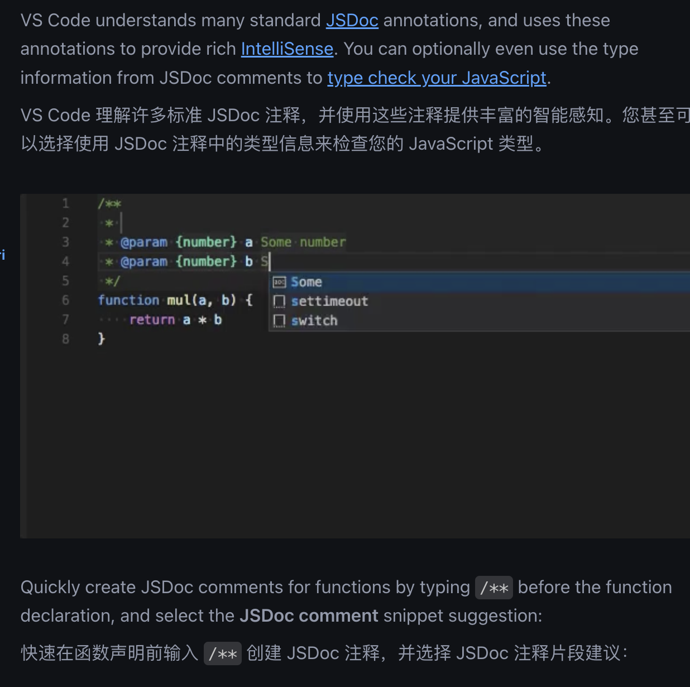

# 专题：异步编程 { .!text-yellow-100}

蓝桥杯Web组 省赛备赛 {.!text-white/50}

---

# 异步编程

<v-clicks class="text-2xl">

1. 使用回调的异步编程

2. 期约(`Promise`)

3. `async`/`await`

</v-clicks>

---


# 使用回调的异步编程

回调就是函数，可以传给其它函数。其它函数会在满足一定条件（或发生一定事件）后，调用这个函数。

<My></My>

<v-clicks>

## 定时器

`setTimeout`:
```js
const ding = () => console.log('dong');

setTimeout(ding, 1000);
```

`setInterval`:
````md magic-move

```js
const beep = () => console.log('beep');

setInterval(beep, 1000);
```

```js
const beep = () => console.log('beep');

let intervalId = setInterval(beep, 1000);
```

```js
let count = 0;
const beep = () => {
  count++;
  console.log('beep');
  if (count === 3) clearInterval(intervalId);
}

let intervalId = setInterval(beep, 1000);
```
````

</v-clicks>

---

# 定时器

注意：`setTimeout`不是真正的等待时间，而是只是一个几秒后执行任务的**回调钩子**。

<Tag name="灯的颜色变化" :difficulty="2" :year="2022" :id="2451" />

---

# 事件

客户端JavaScript几乎全都是事件驱动的。等待用户做一些事，然后响应用户的动作。

<v-clicks>

事件监听器是通过`addEventListener`来添加的。

```js{hide|1|all}
let okey = document.querySelector('#okey');

okey.addEventListener('click', () => {
  console.log('clicked');
});
```

**思考**：如何绑定一个事件？

````md magic-move
```vue

<button>Click me</button>

```

```html

<button onclick="handleClick()">Click me</button>  <!-- 原生JavaScript -->

```


```vue

<button @click="handleClick">Click me</button> <!-- Vue -->

```
````

</v-clicks>

---

# `defineEmits`

https://vuejs.org/guide/components/events.html

<v-clicks>

**思考**：Vue3中如何声明一个组件将发出的事件？

````md magic-move
```vue
<!-- MyComponent -->
<button @click="handleClick">Click Me</button> <!-- 事件将在组件内部被处理 -->
```

```vue
<!-- MyComponent -->
<button @click="$emit('someEvent')">Click Me</button> <!-- 事件将传递给父组件 -->
```

```vue
<!-- MyComponent -->
<button @click="$emit('someEvent', 1, 2, 3)">Click Me</button> <!-- 传递参数 -->
```
````

在`setup`函数中声明事件：

````md magic-move
```js{all|2|3,5|all}
export default {
  emits: ['inFocus', 'submit'],
  setup(props, ctx) {
    ctx.emit('submit')
  }
}
```

```js
export default {
  emits: ['inFocus', 'submit'],
  setup(props, { emit }) {
    emit('submit')
  }
}
```
````

在`<script setup>`中声明事件：

````md magic-move
```vue
<script setup>
defineEmits(['inFocus', 'submit'])
</script>
```

```vue
<script setup>
const emit = defineEmits(['inFocus', 'submit'])

const buttonClick = () => { emit('submit') }
</script>
```

```ts
// TypeScript & Vue3.3+
const emit = defineEmits<{
  inFocus: [id: number]
  submit: [value: string]
}>()
```

````

</v-clicks>

---

## 调用事件处理程序


```js{none|1-4|all}
// 箭头函数 + event参数，拿到事件对象
ele.addEventListener('click', (event) => {
  console.log(event.target);
})

// function函数表达式，使用this拿到事件对象
ele.addEventListener('click', function() {
  console.log(this);
})
```


---

# Node.js中的回调

## `fs`模块

```js{none|1|2-5|6-18|all}
const fs = require("fs"); // "fs"模块有文件系统相关的API
let options = {
  // 保存程序选项的对象
  // 默认选项可以写在这里
};

// 读取配置文件，然后调用回调函数
fs.readFile("config.json", "utf-8", (err, text) => {
  if (err) {
    // 如果有错误，显示一条警告消息，但仍然继续
    console.warn("Could not read config file:", err);
  } else {
    // 否则，解析文件内容并赋值给选项对象
    Object.assign(options, JSON.parse(text));
  }

  startProgram(options);
});
```

---

## `https`模块

```js{none|1|3-4|5-22|6-11|13|15-21|all}{lines:true}
const https = require("https");

function getText(url, callback) {
    request = https.get(url);
    request.on("response", response => { // 处理 "response" 事件
        // 此时收到了响应头
        let httpStatus = response.statusCode;

        // 此时并没有收到 HTTP 响应体，因此还要再注册几个事件处理程序，以便收到响应体时被调用
        response.setEncoding("utf-8");  
        let body = "";                  
        
        response.on("data", chunk => { body += chunk; }); // 每个响应体块就绪时
        
        response.on("end", () => {   // 响应完成时
            if (httpStatus === 200) {  
                callback(null, body);  // 把响应体传给回调
            } else { 
                callback(httpStatus, null);  // 否则传递错误
            }
        });
    });
}
```
<v-click>
思考：这个复杂的代码里一共有几个回调😂？
</v-click>

---

# 期约(`Promise`)

期约是一个对象，表示异步操作的结果。

<v-clicks>

期约有一个最重要的优点，就是<span v-mark.blue="+1">以线性`then`方法</span>调用链的形式表达一系列异步的操作，而不用把每个操作嵌套在前一个操作的回调内部。

## 使用Fetch API

```js
fetch("/api/user/profile").then(response => {  // response: Response
  response.json().then(profile => {  // profile: JSON object
    data.value = profile; // 在Vue3的onMounted钩子里更新数据
  })
})
```

````md magic-move

```js
fetch("/api/user/profile")
 .then(response => {
    return response.json();
 })
 .then(profile => {
    data.value = profile;
  })
```

```js
fetch(url)
 .then(callback1)
 .then(callback2)
```

```js
fetch(url)
 .then(callback1, onError1)
 .then(callback2, onError2)
```


```js
fetch(url)
 .then(callback1, onError1)
 .then(callback2, onError2)
 .then(callback3)
 .catch(error => { console.error(error); }) // 用于处理Promise链中的错误
 .finally(() => { console.log("done"); }); // 用于收尾工作，无论错误与否均会触发
```
````

</v-clicks>

---

## 使用Axios API

```js
axios.get("/api/user/profile").then(response => {  // response: AxiosResponse
  data.value = response.data; // 在Vue3的onMounted钩子里更新数据
})
```

<div class="flex gap-4">
<Tag name="全球新冠疫情数据统计" :difficulty="3" :year="2023" :id="5137" />
<Tag name="课程列表" :difficulty="3" :year="2022" :id="2457" />
</div>

---

# 🎉 `JS Doc`！ 

VS Code在不安装插件的情况下，原生对JS Doc提供支持。

这意味着对于很多后端开发者，或者习惯TypeScript的前端开发者来说，JavaScript不再缺少类型信息。

<v-clicks>

 {.w-1/2 .mx-auto .border .border-red-300}

</v-clicks>

---

# `async`和`await`

<v-clicks>

允许我们以同步的方式编写异步的代码。

我们发现，基于线性`then`的异步代码不能像正常的同步代码一样**返回一个值**或是**抛出一个异常**。

`await`关键字接收一个期约，将其转换成一个返回值或一个抛出的异常。

<div class="w-full justify-center flex gap-20">

  <div class="flex-1">

  ```js
  fetch("/api/user/profile")
  .then(response => {
      return response.json();
  })
  .then(profile => {
      data.value = profile;
    })
  ```

  </div>

  <div class="flex-1">

  ```js
  let response = await fetch("/api/user/profile");
  let profile = await response.json();
  data.value = profile;
  ```

  </div>

</div>

📢 注意：只能在`async`定义的函数中使用`await`关键字。

把函数标注为`async`意味着它**返回一个期约**，而不是直接返回一个值。

</v-clicks>

---

## 并行期约

<v-clicks>

```js
async function getJSON(url) {
  let response = await fetch(url);
  let body = await response.json();
  return body;
}

let value1 = await getJSON("/api/user/profile");
let value2 = await getJSON("/api/user/friends");
```


以上代码的问题在于它本不必顺序执行。要等候一组并发执行的`async`函数，可以使用`Promise.all()`方法。

```js
let [value1, value2] = await Promise.all([
  getJSON("/api/user/profile"),
  getJSON("/api/user/friends")
]);
```

</v-clicks>

---

## 练习：串行期约

有这样一组未知数量的`url`数组，为了避免网络过载，你一次只能抓取一个`url`，编写一个函数来构造这样的期约。

````md magic-move
```js
function fetchAll(urls) {
  const results = [];
  function fetchOne(url) {
    // TODO
  }
  // TODO
}
```

```js{all|3-5|3-8|all}
function fetchAll(urls) {
  const results = [];
  function fetchOne(url) {
    return fetch(url).then(response => response.json());
  }
  urls.forEach(url => {
    results.push(fetchOne(url));
  })
  return Promise.all(results);
}
```

```js{all|3-9|10|10-13|10-14|all}
function fetchAll(urls) {
  const results = [];
  function fetchOne(url) {
    return fetch(url)
              .then(response => response.json())
              .then(result => {
                results.push(result);
              })
  }
  let p = Promise.resolve(); // 立即兑现的期约
  urls.forEach(url => {
    p = p.then(() => fetchOne(url));
  })
  return p.then(() => results);
}
```
````


---

## 练习：`async/await`的实现原理

<v-click>

````md magic-move
```js
async function f(x) { /* body */ }
```

```js
function f(x) {
  return new Promise((resolve, reject) => {
    try {
      resolve(function(x) { /* body */ }(x));
    }
    catch (e) {
      reject(e);
    }
  })
}
```

````

</v-click>
