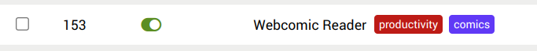

[官方英文文档地址](https://www.tampermonkey.net/documentation.php?ext=dhdg&updated=true&version=5.3.2)

## 用户脚本标题

### @name

脚本的名称。

国际化是通过添加一个命名地区（locale）的附录来实现的。

```
// @name    A test
// @name:de Ein Test
```

### @namespace

脚本的命名空间。

### @copyright

在脚本编辑器头部的脚本名称正下方显示的版权声明。

### @version

脚本版本。这用于更新检查，并且每次更新时都需要增加。

在此列表中，下一个条目被视为更高的版本号，例如：Alpha-v1 < Alpha-v2，以及 16.4 等于 16.04。

- Alpha-v1
- Alpha-v2
- Alpha-v10
- Beta
- 0.5pre3
- 0.5prelimiary
- 0.6pre4
- 0.6pre5
- 0.7pre4
- 0.7pre10
- 1.-1
- 1 == 1. == 1.0 == 1.0.0
- 1.1a
- 1.1aa
- 1.1ab
- 1.1b
- 1.1c
- 1.1.-1
- 1.1 == 1.1.0 == 1.1.00
- 1.1.1.1.1
- 1.1.1.1.2
- 1.1.1.1
- 1.10.0-alpha
- 1.10 == 1.10.0
- 1.11.0-0.3.7
- 1.11.0-alpha
- 1.11.0-alpha.1
- 1.11.0-alpha+1
- 1.12+1 == 1.12+1.0
- 1.12+1.1 == 1.12+1.1.0
- 1.12+2
- 1.12+2.1
- 1.12+3
- 1.12+4
- 1.12
- 2.0
- 16.4 == 16.04
- 2023-08-17.alpha
- 2023-08-17
- 2023-08-17_14-04 == 2023-08-17_14-04.0
- 2023-08-17+alpha
- 2023-09-11_14-0

### @description

一个简短而重要的描述。

国际化是通过添加一个命名地区的附录来实现的。

```
// @description    This userscript does wonderful things
// @description:de Dieses Userscript tut wundervolle Dinge
```

### @icon, @iconURL, @defaulticon

低分辨率下的脚本图标。

### @icon64, @icon64URL

这个脚本的图标为 64x64 像素。如果提供了这个标签（@icon64），但同时也提供了@icon 标签，那么在选项页面的某些位置，@icon 图像将会被缩放。

### @grant

@grant 用于将 GM\__ 和 GM._ 函数、unsafeWindow 对象以及一些强大的 window 函数列入白名单。

```
// @grant GM_setValue
// @grant GM_getValue
// @grant GM.setValue
// @grant GM.getValue
// @grant GM_setClipboard
// @grant unsafeWindow
// @grant window.close
// @grant window.focus
// @grant window.onurlchange
```

由于关闭和聚焦标签页是一个强大的功能，这也需要添加到 @grant 语句中。如果 @grant 后面没有跟随任何内容，那么沙盒模式将被禁用。在这种模式下，将无法使用任何 GM\_\* 函数，但 GM_info 属性仍然可用。

```
// @grant none
```

如果没有给出 @grant 标签，则默认使用空列表。但这与使用 none 是不同的。

### @author

脚本的作者。

### @homepage, @homepageURL, @website, @source

脚本作者的主页，该主页将在选项页面上使用，用于从脚本名称链接到给定的页面。请注意，如果 @namespace 标签以 http:// 开头，那么它的内容也将用于此链接

### @antifeature

此标签允许脚本开发者披露他们是否通过其脚本盈利。例如，GreasyFork 就要求提供此信息。

语法：<标签> <类型> <描述>

<类型> 可以有以下值：

- ads（广告）
- tracking（追踪）
- miner（挖矿）

```
// @antifeature       ads         We show you ads
// @antifeature:fr    ads         Nous vous montrons des publicités
// @antifeature       tracking    We have some sort of analytics included
// @antifeature       miner       We use your computer's resources to mine a crypto currency
```

国际化是通过添加一个命名区域的附录来实现的

### @require

指向一个 JavaScript 文件，该文件将在脚本本身开始运行之前被加载并执行。注意：通过@require 加载的脚本及其‘use strict’声明可能会影响用户脚本的严格模式！

```
// @require https://code.jquery.com/jquery-2.1.4.min.js
// @require https://code.jquery.com/jquery-2.1.3.min.js#sha256=23456...
// @require https://code.jquery.com/jquery-2.1.2.min.js#md5=34567...,sha256=6789...
// @require tampermonkey://vendor/jquery.js
// @require tampermonkey://vendor/jszip/jszip.js
```

请查阅子资源完整性（Sub-resource Integrity，SRI）部分以获取更多关于如何确保完整性的信息。

允许使用多个标签实例

### @resource

预加载可通过 GM_getResourceURL 和 GM_getResourceText 由脚本访问的资源。

```
// @resource icon1       http://www.tampermonkey.net/favicon.ico
// @resource icon2       /images/icon.png
// @resource html        http://www.tampermonkey.net/index.html
// @resource xml         http://www.tampermonkey.net/crx/tampermonkey.xml
// @resource SRIsecured1 http://www.tampermonkey.net/favicon.ico#md5=123434...
// @resource SRIsecured2 http://www.tampermonkey.net/favicon.ico#md5=123434...;sha256=234234...
```

请查阅‘子资源完整性（Sub-resource Integrity，简称 SRI）’部分，以获取更多关于如何确保资源完整性的信息。

允许使用多个标签实例。

### @include

脚本应该运行的页面。允许使用多个标签实例。@include 不支持 URL 的哈希参数。你必须匹配不包含哈希参数的路径，并使用 windowon.urlchange。

```
// @include http://www.tampermonkey.net/*
// @include http://*
// @include https://*
// @include /^https:\/\/www\.tampermonkey\.net\/.*$/
// @include *
```

注意：当编写类似 \*\://tmnk.net/\* 的模式时，许多脚本开发者可能期望脚本仅在 tmnk.net 上运行，但事实并非如此。它同样会在类似 https://example.com/?http://tmnk.net/ 的 URL 上运行。

因此，Tampermonkey 对包含 \:// 的 @include 指令进行了解释，其方式与 @match 指令有些相似。在 \:// 之前的每个 _ 仅匹配除 : 字符之外的所有内容，以确保仅匹配 URL 方案（即协议部分，如 http、https 等）。此外，如果这样的 @include 指令在 \:// 之后包含 /，则这两个字符串之间的所有内容都被视为主机名，匹配除 / 字符之外的所有内容。同样，\:// 之后紧跟的 _ 也遵循这一规则。

### @match

在 Tampermonkey 中，@match 指令用于指定你的脚本应该运行在哪些网页上。@match 的值应该是一个与你希望脚本运行的页面相匹配的 URL 模式。以下是你需要设置的 URL 模式的各个部分：

```
// @match <protocol>://<domain><path>
```

- **协议（Protocol）**：这是 URL 的第一部分，位于冒号之前。它指定了页面使用的协议，如 http 或 https。`*`可以匹配这两种协议。

- **域名（Domain）**：这是 URL 的第二部分，位于协议和两个斜杠之后。它指定了网站的域名，如 tmnk.com。你可以使用通配符`*`来匹配特定域名及其任何子域。例如，`*.tmnk.net`将匹配`tmnk.net`以及任何其子域，如`www.tmnk.net`。

- **路径（Path）**：这是 URL 中位于域名之后的部分，可能包括额外的子目录或文件名。你可以使用通配符`*`来匹配路径的任何部分。

**更多信息**：请查阅相关文档以获取关于匹配模式的更多信息。请注意，`<all_urls>`声明目前尚不支持，并且协议部分也接受`http*://`这样的形式（即可以匹配以`http`开头的任何协议，包括`https`，但通常建议明确指定`https`以确保安全性，除非确实需要匹配非安全协议）。

**多个标签实例**：在 Tampermonkey 脚本中，允许使用多个`@match`标签实例来指定多个匹配模式。这样，你的脚本就可以根据需要在多个不同的网页上运行。

**总结**：在编写 Tampermonkey 脚本时，使用`@match`指令可以精确地指定你的脚本应该在哪些网页上运行。通过合理地设置协议、域名和路径部分，你可以确保你的脚本只在正确的页面上执行，从而避免不必要的资源消耗和潜在的性能问题。同时，请注意遵循最佳实践，确保你的脚本在安全的上下文中运行，并尊重用户的隐私和权限。

更多例子:

```
// @match *://*/*
// @match https://*/*
// @match http://*/foo*
// @match https://*.tampermonkey.net/foo*bar
```

### @exclude

即使某些 URL 被@include 或@match 指令所包含，也排除它们。
允许使用多个标签实例。

### @run-at

`@run-at`定义了脚本注入的时刻。与其他脚本处理程序不同，`@run-at`确定了脚本希望运行的最早可能时刻。这意味着，使用`@require`标签的脚本可能会因为引入脚本耗时较长而在文档加载完成后才执行。

不过，在给定注入时刻之后触发的所有`DOMNodeInserted`和`DOMContentLoaded`事件都会被缓存，并传递给通过沙盒的`window.addEventListener`方法注册的监听器。

```
// @run-at document-start
```

脚本将尽快被注入

```
// @run-at document-body
```

如果存在 body 元素，则脚本将被注入。

```
// @run-at document-end
```

脚本将在 DOMContentLoaded 事件被分发时或之后被注入。

```
// @run-at document-idle
```

脚本将在 DOMContentLoaded 事件分发后被注入。如果没有给出@run-at 标签，则这是默认值。

```
// @run-at context-menu
```

如果在浏览器上下文菜单中点击了该脚本，那么它将被注入。

注意：如果使用此值，那么所有的@include 和@exclude 声明都将被忽略，但未来这可能会发生变化。

### @run-in <sup>v5.3+</sup>

定义脚本被注入的浏览器上下文类型。此元键（meta key）允许您控制脚本是在普通浏览标签页、无痕/隐私标签页中运行，还是两者都运行。这提供了基于浏览会话的隐私上下文来确定脚本行为的灵活性。

```
// @run-in normal-tabs
```

脚本将仅在正常浏览标签页（非无痕模式，默认容器）中被注入。

```
// @run-in incognito-tabs
```

脚本将仅在无痕浏览标签页（隐私模式）中被注入。在 Firefox 中，这意味着所有不使用默认 cookie 存储的标签页。

Firefox 支持容器功能，它允许您将浏览活动分隔到不同的上下文中。您可以在@run-in 标签中指定容器 ID，以基于容器上下文来控制脚本的行为。

```
// @run-in container-id-2
// @run-in container-id-3
```

脚本将仅在被指定容器的标签页中被注入。当脚本在期望的容器上下文中运行时，可以通过检查 GM_info.container 来获取容器 ID。

如果没有指定@run-in 标签，则脚本默认在所有标签页中被注入。

### @sandbox <sup>4.18+</sup>

`@sandbox`标签允许 Tampermonkey 决定用户脚本被注入的位置：

- **MAIN_WORLD** - 页面上下文，即直接在网页的上下文中运行脚本。
- **ISOLATED_WORLD** - 扩展的内容脚本上下文，即在浏览器扩展的隔离环境中运行脚本。
- **USERSCRIPT_WORLD** - 为用户脚本创建的特殊上下文，这是一个专为用户脚本设计的隔离环境。

但是，用户脚本不必直接指定一个环境，而是可以表明它具体需要访问什么。`@sandbox`支持以下三种可能的参数：

**raw（原始）**：

- “原始”访问模式意味着出于兼容性的原因，脚本总是需要在页面上下文（MAIN_WORLD）中运行。
- 如果当前模式未指定`@sandbox`，则默认为此模式。
- 如果由于内容安全策略（CSP）等原因无法将脚本注入到 MAIN_WORLD 中，则用户脚本会根据此列表的顺序被注入到其他已启用的沙箱环境中。

**JavaScript**：

- “JavaScript”访问模式意味着脚本需要访问`unsafeWindow`对象。
- 在 Firefox 中，会创建一个特殊的上下文（USERSCRIPT_WORLD），该上下文还可以绕过现有的内容安全策略（CSP）。
- 然而，这可能会引发新的问题，因为现在需要使用`cloneInto`和`exportFunction`来与页面共享对象。
- 在其他浏览器中，如果无法使用 USERSCRIPT_WORLD，则会回退到 raw 模式。

**DOM**：

- 如果脚本只需要访问 DOM 而不需要直接访问`unsafeWindow`，则使用此访问模式。
- 如果启用此模式，则这些脚本将在扩展的上下文（ISOLATED_WORLD）或其他任何已启用的上下文中执行（因为这些上下文都提供 DOM 访问权限）。

```
// @sandbox JavaScript
```

### @tag

您可以在脚本中添加标签，如果这些标签是您系统标签列表的一部分，那么这些标签将在脚本列表中可见。标签可以用于对脚本进行分类，或者将它们标记为特定类型。您可以在脚本的设置页面中找到标签列表。

带有标签的脚本示例

```
// ==UserScript==
// @name         My Script
// @tag          productivity
// ==/UserScript==
```

### @connect

这个标签定义了允许通过 GM_xmlhttpRequest 函数检索的域名（不包括顶级域名）及其子域名。

```
// @connect <value>
```

`<value>` 可以是：

- 一个域名，如 example.com（这也将允许所有子域名）。
- 一个子域名，如 subdomain.example.com。
- `self`，以将当前正在运行脚本的域名加入白名单。
- `localhost`，以访问本地主机。
- 一个 IP 地址，如 1.2.3.4。
- `*`，代表所有域名。

如果无法声明用户脚本可能连接的所有域名，那么以下做法是一个好习惯：

- 声明所有已知或至少所有常见的域名，这些域名可能是脚本要连接的，以避免大多数用户看到确认对话框。
- 另外，在脚本中添加 `@connect *`，以允许 Tampermonkey 提供一个“始终允许所有域名”的按钮。
- 用户还可以通过在脚本设置选项卡中的用户域名白名单中添加 `*` 来将所有请求加入白名单。

注意事项：

- 初始 URL 和最终 URL 都将被检查！
- 为了与 Scriptish 向后兼容，也会解释 `@domain` 标签。
- 允许多个标签实例。

更多示例：

```
// @connect tmnk.net
// @connect www.tampermonkey.net
// @connect self
// @connect localhost
// @connect 8.8.8.8
// @connect *
```


### @noframes

此标签使脚本仅在主页面上运行，而不在 iframe 中运行。这有助于避免脚本在嵌入的框架内执行，可能引发安全问题或不必要的行为。

### @updateURL

用户脚本的更新 URL。注意：要使更新检查生效，必须包含`@version`标签。此 URL 指向一个包含脚本新版本的位置，Tampermonkey 等用户脚本管理器会定期检查此 URL 以查找更新。

### @downloadURL

当检测到更新时，定义脚本将从哪个 URL 下载。如果使用值`none`，则不进行更新检查。此标签允许您指定一个特定的下载位置，用于获取脚本的最新版本。

### @supportURL

定义用户可以报告问题和获得个人支持的 URL。这是一个有用的资源链接，用户可以在遇到脚本问题时访问，以获取帮助或提交错误报告。

### @webRequest

`@webRequest`接受一个与`GM_webRequest`的规则参数相匹配的 JSON 文档。它允许规则在用户脚本加载之前应用。此标签允许您设置网络请求的拦截和处理规则，以便在脚本实际运行之前修改或阻止请求。

### @unwrap

将用户脚本直接注入到页面中，而不使用任何包装器或沙箱。这可能对于 Scriptlets（小型、嵌入式的脚本片段）特别有用，因为它们可能需要直接访问页面的全局作用域。但是，请注意，使用`@unwrap`可能会增加安全风险，因为它会绕过 Tampermonkey 等管理器提供的某些安全机制。

## 应用程序接口

### unsafeWindow

`unsafeWindow` 对象允许访问 Tampermonkey 正在运行的页面上的 `window` 对象，而非 Tampermonkey 扩展自身的 `window` 对象。这在某些情况下可能很有用，例如，当用户脚本需要访问页面上定义的 JavaScript 库或变量时。

### Subresource Integrity

Subresource Integrity (SRI) 是一种安全功能，它使用户脚本开发者能够确保他们在用户脚本中包含的外部资源（如 JavaScript 库和 CSS 文件）未被篡改或修改。这是通过生成资源的加密哈希值，并将其包含在 `@require` 和 `@resource` 标签中来实现的。当用户脚本被安装时，Tampermonkey 会计算资源的哈希值，并将其与包含的哈希值进行比较。如果两个哈希值不匹配，Tampermonkey 将拒绝加载该资源，从而防止攻击者将恶意代码注入到您的用户脚本中。

`@resource` 和 `@require` 标签的 URL 中的哈希部分就是用于此目的的。

```
// @resource SRIsecured1 http://example.com/favicon1.ico#md5=ad34bb...
// @resource SRIsecured2 http://example.com/favicon2.ico#md5=ac3434...,sha256=23fd34...
// @require              https://code.jquery.com/jquery-2.1.1.min.js#md5=45eef...
// @require              https://code.jquery.com/jquery-2.1.2.min.js#md5-ac56d...,sha256-6e789...
// @require              https://code.jquery.com/jquery-3.6.0.min.js#sha256-/xUj+3OJU...ogEvDej/m4=
```

Tampermonkey 原生支持 SHA-256 和 MD5 哈希，其他哈希（如 SHA-1、SHA-384 和 SHA-512）则依赖于 `window.crypto`。

如果提供了多个哈希值（用逗号或分号分隔），Tampermonkey 将使用当前支持的最后一个哈希值。所有哈希值都需要以十六进制（hex）或 Base64 格式进行编码。

### GM_addElement(tag_name, attributes), GM_addElement(parent_node, tag_name, attributes)

`unsafeWindow` 对象允许访问 Tampermonkey 正在运行的页面上的 `window` 对象，而非 Tampermonkey 扩展自身的 `window` 对象。这在某些情况下可能很有用，例如，当用户脚本需要访问页面上定义的 JavaScript 库或变量时。
`GM_addElement` 允许 Tampermonkey 脚本向 Tampermonkey 正在运行的页面添加新元素。这可以用于多种目的，例如，如果页面通过内容安全策略 (CSP) 限制这些元素，则可以添加 script 和 img 标签。

它根据指定的“tag_name”创建一个 HTML 元素，并应用所有给定的“attributes”，然后返回注入的 HTML 元素。如果提供了“parent_node”，则将其附加到该节点上，否则附加到文档的 head 或 body 上。

有关合适的“attributes”，请参阅相应的文档。例如：

- script 标签
- img 标签
- style 标签

```
GM_addElement('script', {
  textContent: 'window.foo = "bar";'
});

GM_addElement('script', {
  src: 'https://example.com/script.js',
  type: 'text/javascript'
});

GM_addElement(document.getElementsByTagName('div')[0], 'img', {
  src: 'https://example.com/image.png'
});

GM_addElement(shadowDOM, 'style', {
  textContent: 'div { color: black; };'
});
```

注意：此功能为实验性功能，API 可能会发生变化。

```
GM_addStyle(css)
```

将给定的样式添加到文档中，并返回注入的 style 元素。

### GM_download(details), GM_download(url, name)

`GM_download` 允许用户脚本从指定的 URL 下载文件并将其保存到用户的本地计算机。

`GM_download` 函数接受以下参数：

`details` 可以具有以下属性：

- `url`：要下载文件的 URL。这必须是一个有效的 URL，并且必须指向用户可访问的文件。
- `name`：下载文件要使用的名称。这应该包括文件的扩展名，如 `.txt` 或 `.pdf`。出于安全原因，文件扩展名需要在 Tampermonkey 的选项页面中列入白名单。
- `headers`：一个包含要在下载请求中包含的 HTTP 头的对象。有关更多详细信息，请参阅 `GM_xmlhttpRequest`。
- `saveAs`：一个布尔值，指示是否使用用户的默认下载位置，或者提示用户选择其他位置。此选项仅在浏览器 API 模式下有效。
- `conflictAction`：一个字符串，控制当具有此名称的文件已存在时发生的情况。此选项仅在浏览器 API 模式下有效。可能的值是 `uniquify`（唯一化）、`overwrite`（覆盖）和 `prompt`（提示）。有关更多详细信息，请参阅此链接。
- `onload`：下载成功完成时调用的函数。
- `onerror`：下载失败或被取消时调用的函数。
- `onprogress`：如果下载取得了一些进展，要执行的回调函数。
- `ontimeout`：如果下载因超时而失败，要执行的回调函数。

`onerror` 回调的 `download` 参数可以具有以下属性：

- `error`：错误原因，可能的值包括 `not_enabled`（下载功能未由用户启用）、`not_whitelisted`（请求的文件扩展名未列入白名单）、`not_permitted`（用户启用了下载功能，但未给予下载权限）、`not_supported`（浏览器/版本不支持下载功能）、`not_succeeded`（下载未启动或失败，`details` 属性可能提供更多信息）。
- `details`：有关该错误的详细信息。

返回一个具有以下属性的对象：

- `abort`：一个函数，可以调用它来取消此下载。

如果使用 `GM.download`，它将返回一个解析为下载详细信息的 Promise，并且还具有一个 `abort` 函数。

根据下载模式，`GM_info` 提供了一个名为 `downloadMode` 的属性，其值设置为以下值之一：`native`（原生）、`disabled`（禁用）或 `browser`（浏览器）。

```
GM_download("http://example.com/file.txt", "file.txt");

const download = GM_download({
    url: "http://example.com/file.txt",
    name: "file.txt",
    saveAs: true
});

// cancel download after 5 seconds
window.setTimeout(() => download.abort(), 5000);
```

注意：浏览器可能会修改所需的文件名。特别是，如果浏览器认为在当前操作系统上下载该文件是安全的，它可能会添加一个文件扩展名。

### GM_getResourceText(name)

允许用户脚本访问通过@resource 指令在用户脚本中包含的资源（例如 JavaScript 或 CSS 文件）的文本内容。

该函数接受一个参数，即要检索的资源的“名称”。它返回该资源的文本内容，形式为字符串。

以下是该函数的使用示例：

```
const scriptText = GM_getResourceText("myscript.js");
const scriptText2 = await GM.getResourceText("myscript.js");
const script = document.createElement("script");
script.textContent = scriptText;
document.body.appendChild(script);
```

### GM_getResourceURL(name)

`GM_getResourceURL` 允许用户脚本访问通过脚本头部 `@resource` 标签包含的资源（如 CSS 或图像文件）的 URL。

该函数接受一个参数，即要检索资源的“名称”。它返回该资源的 URL，形式为字符串。

```
const imageUrl = GM_getResourceURL("myimage.png");
const imageUrl2 = await GM.getResourceUrl("myimage.png");
const image = document.createElement("img");
image.src = imageUrl;
document.body.appendChild(image);
```

重要提示：此函数的基于 Promise 的版本称为 `GM.getResourceUrl`（在“Url”中的“u”和“l”为小写）。

### GM_info

获取有关脚本和任务管理（TM）的一些信息。相关信息对象可能如下所示：

```
type ScriptGetInfo = {
    container?: { // 5.3+ | Firefox only
        id: string,
        name?: string
    },
    downloadMode: string,
    isFirstPartyIsolation?: boolean,
    isIncognito: boolean,
    sandboxMode: SandboxMode, // 4.18+
    scriptHandler: string,
    scriptMetaStr: string | null,
    scriptUpdateURL: string | null,
    scriptWillUpdate: boolean,
    userAgentData: UADataValues, // 4.19+
    version?: string,
    script: {
        antifeatures: { [antifeature: string]: { [locale: string]: string } },
        author: string | null,
        blockers: string[],
        connects: string[],
        copyright: string | null,
        deleted?: number | undefined,
        description_i18n: { [locale: string]: string } | null,
        description: string,
        downloadURL: string | null,
        excludes: string[],
        fileURL: string | null,
        grant: string[],
        header: string | null,
        homepage: string | null,
        icon: string | null,
        icon64: string | null,
        includes: string[],
        lastModified: number,
        matches: string[],
        name_i18n: { [locale: string]: string } | null,
        name: string,
        namespace: string | null,
        position: number,
        resources: Resource[],
        supportURL: string | null,
        system?: boolean | undefined,
        'run-at': string | null,
        'run-in': string[] | null, // 5.3+
        unwrap: boolean | null,
        updateURL: string | null,
        version: string,
        webRequest: WebRequestRule[] | null,
        options: {
            check_for_updates: boolean,
            comment: string | null,
            compatopts_for_requires: boolean,
            compat_wrappedjsobject: boolean,
            compat_metadata: boolean,
            compat_foreach: boolean,
            compat_powerful_this: boolean | null,
            sandbox: string | null,
            noframes: boolean | null,
            unwrap: boolean | null,
            run_at: string | null,
            run_in: string | null, // 5.3+
            override: {
                use_includes: string[],
                orig_includes: string[],
                merge_includes: boolean,
                use_matches: string[],
                orig_matches: string[],
                merge_matches: boolean,
                use_excludes: string[],
                orig_excludes: string[],
                merge_excludes: boolean,
                use_connects: string[],
                orig_connects: string[],
                merge_connects: boolean,
                use_blockers: string[],
                orig_run_at: string | null,
                orig_run_in: string[] | null, // 5.3+
                orig_noframes: boolean | null
            }
        }
    }
};

type SandboxMode = 'js' | 'raw' | 'dom';

type Resource = {
    name: string,
    url: string,
    error?: string,
    content?: string,
    meta?: string
};

type WebRequestRule = {
    selector: { include?: string | string[], match?: string | string[], exclude?: string | string[] } | string,
    action: string | {
        cancel?: boolean,
        redirect?: {
            url: string,
            from?: string,
            to?: string
        } | string
    }
};

type UADataValues = {
    brands?: {
        brand: string;
        version: string;
    }[],
    mobile?: boolean,
    platform?: string,
    architecture?: string,
    bitness?: string
}
```

### GM_log(message)

直接在控制台记录一条消息。

### GM_notification(details, ondone), GM_notification(text, title, image, onclick)

`GM_notification`允许用户使用提供的消息和其他可选参数在屏幕上显示通知。

该函数接受多个参数，可以是一个包含详细信息的对象，也可以是多个参数。

详细信息对象可以包含以下属性，其中一些也可以作为直接参数使用：

可用选项包括：

- `text`：字符串类型，包含要在通知中显示的消息。
- `title`：通知的标题。
- `tag`（5.0+版本）：此标签用于标识此通知。这样，你可以通过再次调用`GM_notification`并使用相同的标签来更新现有的通知。如果不提供标签，则每次都会创建一个新的通知。
- `image`：要在通知中显示的图像的 URL。
- `highlight`：布尔值，指示是否高亮显示发送通知的标签（除非设置了`text`，否则为必需）。
- `silent`：布尔值，指示是否不播放声音。
- `timeout`：以毫秒为单位的时间，之后通知应自动关闭。
- `url`（5.0+版本）：用户点击通知时要加载的 URL。你可以在`onclick`事件处理器中调用`event.preventDefault()`来阻止加载 URL。
- `onclick`：当用户点击通知时要调用的回调函数。
- `ondone`：当通知关闭（无论是由超时还是点击触发的）或标签被高亮显示时调用的回调函数。

该函数不返回任何值。

如果没有提供`url`和`tag`，则当用户脚本卸载时（例如，当页面重新加载或标签页关闭时），通知将关闭（5.0+版本）。

以下是一个函数使用方法的示例：

```
GM_notification({
  text: "This is the notification message.",
  title: "Notification Title",
  url: 'https:/example.com/',
  onclick: (event) => {
    // The userscript is still running, so don't open example.com
    event.preventDefault();
    // Display an alert message instead
    alert('I was clicked!')
  }
});

const clicked = await GM.notification({ text: "Click me." });
```

### GM_openInTab(url, options), GM_openInTab(url, loadInBackground)


`GM_openInTab`允许用户脚本在浏览器中打开一个新标签页并导航到指定的 URL。

该函数接受两个参数：

1. 一个名为`url`的字符串，包含要在新标签页中打开的页面的 URL。

2. 一个可选的选项对象，可用于自定义新标签页的行为。可用选项包括：

   - `active`：一个布尔值，指示新标签页是否应该处于活动状态（被选中）。默认值为`false`。
   - `insert`：一个整数，指示新标签页应该在标签栏中的哪个位置插入。默认值为`false`，这意味着新标签页将被添加到标签栏的末尾。
   - `setParent`：一个布尔值，指示新标签页是否应被视为当前标签页的子标签页。默认值为`false`。
   - `incognito`：一个布尔值，使标签页在隐身模式/私密模式窗口中打开。
   - `loadInBackground`：一个布尔值，与`active`具有相反的含义，并且是为了实现与 Greasemonkey 3.x 的兼容性而添加的。

该函数返回一个对象，该对象包含`close`函数、`onclose`监听器和一个名为`closed`的标志。

以下是一个函数使用方法的示例：

```
// Open a new tab and navigate to the specified URL
GM_openInTab("https://www.example.com/");
```

### GM_registerMenuCommand(name, callback, options_or_accessKey)
`GM_registerMenuCommand`允许用户脚本在浏览器的用户脚本菜单中添加一个新条目，并指定当选择该菜单项时要调用的函数。如果从不同框架创建的菜单项具有相同的名称、标题和访问键，则它们将被合并为一个菜单条目。

该函数接受三个参数：

1. `name`（字符串）：要显示在菜单项中的文本。
2. `callback`（函数）：当选择菜单项时要调用的函数。该函数将接收一个参数，即当前活动的标签页。从Tampermonkey 4.14开始，会传递一个`MouseEvent`或`KeyboardEvent`作为函数参数。
3. `accessKey`（字符串，可选）：一个可选的访问键。请注意下面的描述。可以指定选项对象或访问键。

从v4.20+版本开始，还可以传递一个可选的`options`对象来自定义菜单项。`options`对象具有以下属性：

- `id`（v5.0+版本，数字或字符串，可选）：之前`GM_registerMenuCommand`调用返回的可选数字。如果指定了此参数，则使用新选项更新相应的菜单项。如果没有指定或找不到菜单项，则创建一个新的菜单项。
- `accessKey`（字符串，可选）：菜单项的可选访问键。这可用于为菜单项创建快捷键。例如，如果访问键是“s”，则当用户打开Tampermonkey的弹出菜单时，可以通过按“s”来选择菜单项。请注意，可以在浏览器中配置全局快捷键来打开Tampermonkey的弹出菜单。（在Chrome中为`chrome://extensions/shortcuts`，在Firefox中为“about:addons”+“管理扩展快捷键”）
- `autoClose`（布尔值，可选）：一个可选的布尔参数，指定在点击菜单项后是否应关闭弹出菜单。默认值为`true`。请注意，此设置对添加到页面上下文菜单中的菜单命令部分没有影响。
- `title`（v5.0+版本，字符串，可选）：一个可选的字符串，指定菜单项的标题。当用户将鼠标悬停在菜单项上时，将显示此标题作为工具提示。

该函数返回一个菜单条目ID，可用于注销命令。

以下是一个函数使用方法的示例：
```
const menu_command_id_1 = GM_registerMenuCommand("Show Alert", function(event: MouseEvent | KeyboardEvent) {
  alert("Menu item selected");
}, {
  accessKey: "a",
  autoClose: true
});

const menu_command_id_2 = GM_registerMenuCommand("Log", function(event: MouseEvent | KeyboardEvent) {
  console.log("Menu item selected");
}, "l");
```
### GM_unregisterMenuCommand(menuCmdId)

`GM_unregisterMenuCommand` 从用户脚本在浏览器中的菜单中移除一个已存在的条目。

该函数接受一个参数，即要移除的菜单项的 ID。它不返回任何值。

以下是如何使用该函数的一个示例：
```
const menu_command_id = GM_registerMenuCommand(...);
GM_unregisterMenuCommand(menu_command_id);
```
### GM_setClipboard(data, info, cb)

`GM_setClipboard` 将剪贴板的文本设置为一个指定的值。

该函数接收一个参数 “data”，即要设置为剪贴板文本的字符串，一个参数 “info”，以及一个可选的回调函数 “cb”。

“info” 可以仅是一个表示文本或HTML类型的字符串（但请注意，具体实现可能有所不同）。

“cb” 是一个可选的回调函数，当剪贴板设置完成后会被调用。
```
{
    type: 'text',
    mimetype: 'text/plain'
}
```
```
GM_setClipboard("This is the clipboard text.", "text", () => console.log("Clipboard set!"));
await GM.setClipboard("This is the newer clipboard text.", "text");
console.log('Clipboard set again!');
```
### GM_getTab(callback)
`GM_getTab` 函数接受一个参数，即一个回调函数。该回调函数会传入一个对象，只要该标签页保持打开状态，该对象就会一直存在。
```
GM_getTab((tab) => console.log(tab));
const t = await GM.getTab();
console.log(t);
```
### GM_saveTab(tab, cb)
`GM_saveTab` 函数允许用户脚本保存有关标签页的信息以供后续使用。

该函数接受一个“tab”参数，该参数是一个对象，包含了要保存的关于标签页的信息，以及一个可选的回调函数“cb”。

`GM_saveTab` 函数会保存提供的标签页信息，以便稍后可以使用 `GM_getTab` 函数来检索它。

以下是一个用户脚本中使用 `GM_saveTab` 函数的示例：
```
GM_getTab(function(tab) {
    tab.newInfo = "new!";
    GM_saveTab(tab);
});
await GM.saveTab(tab);
```
在这个例子中，`GM_saveTab` 函数被调用时，传入了由 `GM_getTab` 函数返回的标签页对象，并且添加了一个名为 `"newInfo"` 的新键。

### GM_getTabs(callback)
`GM_getTabs` 函数接受一个参数：一个回调函数。该回调函数会接收到关于标签页的信息。

传递给回调函数的“tabs”对象包含了多个对象，每个对象都代表了由 `GM_saveTab` 存储的已保存标签页的信息。
```
GM_getTabs((tabs) => {
    for (const [tabId, tab] of Object.entries(tabs)) {
        console.log(`tab ${tabId}`, tab);
    }
});
const tabs = await GM.getTabs();
```

### GM_setValue(key, value)
`GM_setValue` 允许用户脚本设置用户脚本存储中特定键的值。

`GM_setValue` 函数接受两个参数：

1. 一个字符串，指定要设置值的键。
2. 要为该键设置的值。值（包括嵌套对象属性）可以为 `null` 或 `object`、`string`、`number`、`undefined` 或 `boolean` 类型。

`GM_setValue` 函数不返回任何值。相反，它在用户脚本的存储中为指定的键设置提供的值。

以下是 `GM_setValue` 及其异步版本 `GM.setValue` 在用户脚本中可能的使用示例：
```
GM_setValue("someKey", "someData");
await GM.setValue("otherKey", "otherData");
```
### GM_getValue(key, defaultValue)
`GM_getValue` 函数允许用户脚本检索用户脚本存储中特定键的值。它接受两个参数：

1. 一个字符串，指定要检索值的键。
2. 如果在用户脚本的存储中不存在该键，则要返回的默认值。这个默认值可以是任何类型（字符串、数字、对象等）。

`GM_getValue` 函数返回用户脚本存储中指定键的值，如果键不存在，则返回默认值。

以下是一个在用户脚本中使用 `GM_getValue` 函数的示例：
```
const someKey = GM_getValue("someKey", null);
const otherKey = await GM.getValue("otherKey", null);
```

### GM_deleteValue(key)
从用户脚本的存储中删除‘key’。
```
GM_deleteValue("someKey");
await GM.deleteValue("otherKey");
```

### GM_listValues()
GM_listValues 函数返回所有存储数据的键名列表。
```
const keys = GM_listValues();
const asyncKeys = await GM.listValues();
```

### GM_setValues(values) <sup>v5.3+</sup>


`GM_setValues`函数允许用户脚本同时在用户脚本的存储中设置多个键值对。

`GM_setValues`函数接受一个参数：

一个对象，其中每个键值对都对应一个键和要为该键设置的值。值（包括嵌套对象属性）可以是`null`或`object`、`string`、`number`、`undefined`或`boolean`类型。

`GM_setValues`函数不返回任何值。相反，它在用户脚本的存储中为指定的键设置提供的值。

以下是一个关于如何在用户脚本中使用`GM_setValues`及其异步对应函数`GM.setValues`的示例：
```
GM_setValues({ foo: 1, bar: 2 });
await GM.setValues({ foo: 1, bar: 2 });
```

### GM_getValues(keysOrDefaults) <sup>v5.3+</sup>

GM_getValues 函数允许用户脚本检索用户脚本存储中多个键的值。如果键不存在，它还可以提供默认值。

GM_getValues 函数接受一个参数：

要么是一个字符串数组，指定要检索其值的键；要么是一个对象，指定如果键不存在时要返回的默认值。这个默认值对象可以包含任何类型的键（字符串、数字、对象等）。
GM_getValues 函数返回一个对象，包含用户脚本存储中指定键的值，如果键不存在，则返回默认值。

以下是一个在用户脚本中使用 GM_getValues 函数的示例：
```
const values = GM_getValues(['foo', 'bar']);
const asyncValues = await GM.getValues(['foo', 'bar']);

const defaultValues = GM_getValues({ foo: 1, bar: 2, baz: 3 });
const asyncDefaultValues = await GM.getValues({ foo: 1, bar: 2, baz: 3 });
```
在这个示例中，GM_getValues 函数被调用时传入一个键的数组或一个包含默认值的对象。它返回一个对象，其中包含指定键的值，如果键不存在，则返回相应的默认值。

### GM_deleteValues(keys) <sup>v5.3+</sup>
GM_deleteValues 函数允许用户脚本同时删除用户脚本存储中的多个键。

GM_deleteValues 函数接受一个参数：

一个字符串数组，指定要从用户脚本存储中删除的键。

GM_deleteValues 函数不返回任何值。相反，它会从用户脚本存储中删除指定的键。

以下是一个在用户脚本中使用 GM_deleteValues 及其异步版本 GM.deleteValues 的示例：
```
GM_deleteValues(['foo', 'bar']);
await GM.deleteValues(['foo', 'bar']);
```
### GM_addValueChangeListener(key, (key, old_value, new_value, remote) => void)
GM_addValueChangeListener 函数允许用户脚本添加一个监听器，用于监听用户脚本存储中特定键值的变化。

该函数接受两个参数：

一个字符串，指定要监视变化的键。

一个回调函数，当键的值发生变化时，将调用此函数。回调函数的签名应如下：
```
  function(key, oldValue, newValue, remote) {
      // key is the key whose value has changed
      // oldValue is the previous value of the key
      // newValue is the new value of the key
      // remote is a boolean indicating whether the change originated from a different userscript instance
  }
```
### GM_addValueChangeListener 函数与监听器ID

GM_addValueChangeListener 函数返回一个“listenerId”值，可以使用该值在稍后通过 GM_removeValueChangeListener 函数移除监听器。对于 GM.addValueChangeListener 和 GM.removeValueChangeListener 函数，情况完全相同，唯一的区别是它们都返回一个 Promise。

以下是一个在用户脚本中使用 GM_addValueChangeListener 函数的示例：
```
// Add a listener for changes to the "savedTab" key
var listenerId = GM_addValueChangeListener("savedTab", function(key, oldValue, newValue, remote) {
  // Print a message to the console when the value of the "savedTab" key changes
  console.log("The value of the '" + key + "' key has changed from '" + oldValue + "' to '" + newValue + "'");
});
```
用户脚本可以利用 GM_addValueChangeListener 与其他标签页中的其他用户脚本实例进行通信。

### GM_removeValueChangeListener(listenerId)
GM_removeValueChangeListener 和 GM.removeValueChangeListener 均接收一个名为“listenerId”的参数，并根据此 ID 删除对应的变化监听器。

### GM_xmlhttpRequest(details)

GM_xmlhttpRequest 允许用户脚本发送 HTTP 请求并处理响应。该函数接受一个参数：一个包含要发送的请求的详细信息以及接收到响应时要调用的回调函数的对象。

该对象可以具有以下属性：

- method：字符串，通常是 GET、HEAD、POST、PUT、DELETE 等之一。
- url：字符串或 URL 对象，表示目标 URL。
- headers：例如 user-agent、referer 等（某些特殊头信息在 Safari 和 Android 浏览器中不受支持）。
- data：字符串、Blob、File、对象、数组、FormData 或 URLSearchParams（可选），表示要通过 POST 请求发送的一些数据。
- redirect：follow、error 或 manual 之一；控制检测到重定向时要执行的操作（构建版本 6180+，强制使用 fetch 模式）。
- cookie：要修补到发送的 cookie 集中的 cookie。
- cookiePartition（v5.2+）：对象（可选），包含用于发送和接收分区 cookie 的分区键。
- topLevelSite（可选）：字符串，表示分区 cookie 的顶级框架站点。
- binary：以二进制模式发送数据字符串。
- nocache：不缓存资源。
- revalidate：重新验证可能已缓存的内容。
- timeout：以毫秒为单位的超时时间。
- context：将添加到响应对象的属性。
- responseType：arraybuffer、blob、json 或 stream 之一。
- overrideMimeType：请求的 MIME 类型。
- anonymous：不随请求发送 cookie（强制使用 fetch 模式）。
- fetch：使用 fetch 而不是 XMLHttpRequest 请求（在 Chrome 中，这会导致 details.timeout 和 xhr.onprogress 无法工作，并使 xhr.onreadystatechange 只接收 readyState DONE（==4）事件）。
- user：用于身份验证的用户名。
- password：密码。
- onabort：如果请求被中止，要执行的回调函数。
- onerror：如果请求以错误结束，要执行的回调函数。
- onloadstart：在加载开始时执行，如果 responseType 设置为 stream，则提供对 stream 对象的访问。
- onprogress：如果请求取得了一些进展，要执行的回调函数。
- onreadystatechange：如果请求的 readyState 发生变化，要执行的回调函数。
- ontimeout：如果请求因超时而失败，要执行的回调函数。
- onload：如果请求已加载，要执行的回调函数。

```
  function(response) {
    // response is an object containing the details of the response
  }
```
**response 对象的属性**

- finalUrl：数据加载后经过所有重定向的最终 URL。
- readyState：请求的 readyState。
- status：请求的 HTTP 状态码。
- statusText：请求的 HTTP 状态文本。
- responseHeaders：请求的响应头。
- response：如果 details.responseType 已设置，则为作为对象的响应数据。
- responseXML：作为 XML 文档的响应数据。
- responseText：作为纯字符串的响应数据。

**GM_xmlhttpRequest 返回的对象**

GM_xmlhttpRequest 返回一个具有以下属性的对象：

- abort：用于取消此请求的函数。

**GM.xmlHttpRequest 返回的 Promise**

GM.xmlHttpRequest 返回一个解析为响应的 Promise，并且也具有一个 abort 函数。

**用户脚本中使用 GM_xmlhttpRequest 函数的示例**

以下是一个在用户脚本中使用 GM_xmlhttpRequest 函数的示例：
```
GM_xmlhttpRequest({
  method: "GET",
  url: "https://example.com/",
  headers: {
    "Content-Type": "application/json"
  },
  onload: function(response) {
    console.log(response.responseText);
  }
});

const r = await GM.xmlHttpRequest({ url: "https://example.com/" }).catch(e => console.error(e));
console.log(r.responseText);
```

“请注意，`details` 中的同步标志不受支持。

重要提示：

如果您想使用此方法，请务必查阅关于 `@connect` 的文档。

此函数的基于 Promise 的版本称为 `GM.xmlHttpRequest`（注意 `http` 中的 `h` 是大写）。”

### GM_webRequest(rules, listener)

注意：此API为实验性API，可能会随时更改。在Tampermonkey 5.2及以上版本中已不再可用。

`GM_webRequest`（重新）注册用于网页请求操作的规则和触发规则的监听器。如果您只需要注册规则，则最好使用`@webRequest`头部。请注意，`webRequest`仅处理类型为`sub_frame`、`script`、`xhr`和`websocket`的请求。

**参数**：
- `rules` - `object[]`，包含以下属性的规则数组：
  - `selector` - `string|object`，触发规则的URL，字符串值为`{ include: [selector] }`的简写，对象属性包括：
    - `include` - `string|string[]`，用于触发规则的URL、模式和正则表达式；
    - `match` - `string|string[]`，用于触发规则的URL和模式；
    - `exclude` - `string|string[]`，不触发规则的URL、模式和正则表达式；
  - `action` - `string|object`，对请求执行的操作，字符串值`"cancel"`为`{ cancel: true }`的简写，对象属性包括：
    - `cancel` - `boolean`，是否取消请求；
    - `redirect` - `string|object`，重定向到某个URL，该URL必须包含在任何`@match`或`@include`头部中。当为字符串时，重定向到静态URL。如果为对象：
      - `from` - `string`，用于提取URL某些部分的正则表达式，例如`"([^:]+)://match.me/(.*)"`；
      - `to` - `string`，用于替换的模式，例如`"$1://redirected.to/$2"`；
  - `listener` - `function`，当规则触发时调用，无法影响规则操作，参数包括：
    - `info` - `string`，操作类型："cancel"、"redirect"；
    - `message` - `string`，"ok"或"error"；
    - `details` - `object`，有关请求和规则的信息：
      - `rule` - `object`，触发的规则；
      - `url` - `string`，请求的URL；
      - `redirect_url` - `string`，请求被重定向到的URL；
      - `description` - `string`，错误描述。

示例
```
GM_webRequest([
    { selector: '*cancel.me/*', action: 'cancel' },
    { selector: { include: '*', exclude: 'http://exclude.me/*' }, action: { redirect: 'http://new_static.url' } },
    { selector: { match: '*://match.me/*' }, action: { redirect: { from: '([^:]+)://match.me/(.*)',  to: '$1://redirected.to/$2' } } }
], function(info, message, details) {
    console.log(info, message, details);
});
```

### GM_cookie.list(details[, callback])

注意：目前，仅Tampermonkey的BETA版本支持`httpOnly` cookie。

Tampermonkey会检查脚本是否具有对给定`details.url`参数的`@include`或`@match`访问权限！

**参数**：
- `details` 对象，包含要检索的cookie的属性
- `url` 字符串（可选），表示要从中检索cookie的URL（默认为当前文档URL）
- `domain` 字符串（可选），表示要检索的cookie的域
- `name` 字符串（可选），表示要检索的cookie的名称
- `path` 字符串（可选），表示要检索的cookie的路径
- `partitionKey`（v5.2+）对象（可选），表示cookie的分区键，使用空对象以检索所有cookie
- `topLevelSite` 字符串（可选），表示cookie的顶级框架站点
- `callback` 函数（可选），当检索到cookie时调用。该函数将接收两个参数：
  - `cookies` 对象数组，表示检索到的cookie
  - `error` 字符串，如果发生错误，则表示错误消息，否则为null。

**cookie对象具有以下属性**：

- `domain` 字符串，表示cookie的域
- `expirationDate` 数字（可选），自Unix纪元以来的cookie过期日期（以秒为单位）。如果未指定，则cookie永不过期。
- `firstPartyDomain` 字符串（可选），表示cookie的第一方域。
- `partitionKey`（v5.2+）对象（可选），包含cookie的分区键
- `topLevelSite` 字符串（可选），表示cookie的顶级框架站点
- `hostOnly` 布尔值，指示cookie是否为仅主机cookie
- `httpOnly` 布尔值，指示cookie是否为HTTP专用cookie
- `name` 字符串，表示cookie的名称
- `path` 字符串，表示cookie的路径
- `sameSite` 字符串，指示cookie的SameSite属性
- `secure` 布尔值，指示cookie是否需要安全连接
- `session` 布尔值，指示cookie是否为会话cookie
- `value` 字符串，表示cookie的值
示例用法：
```
// Retrieve all cookies with name "mycookie"
GM_cookie.list({ name: "mycookie" }, function(cookies, error) {
  if (!error) {
    console.log(cookies);
  } else {
    console.error(error);
  }
});

// Retrieve all cookies for the current domain
const cookies = await GM.cookie.list()
console.log(cookies);
```

### GM_cookie.set(details[, callback])
**设置Cookie的示例用法**：

使用以下参数设置具有给定详细信息的Cookie。支持的属性定义如下：

参数：
details：一个包含要设置的Cookie详细信息的对象。该对象可以具有以下属性：
- url（字符串，可选）：与Cookie关联的URL。如果未指定，则Cookie与当前文档的URL关联。
- name（字符串）：Cookie的名称。
- value（字符串）：Cookie的值。
- domain（字符串，可选）：Cookie的域。
- firstPartyDomain（字符串，可选）：Cookie的第一方域。
- partitionKey（v5.2+ 对象，可选）：包含Cookie的分区键。
- topLevelSite（字符串，可选）：表示Cookie的顶级框架站点。
- path（字符串，可选）：Cookie的路径。
- secure（布尔值，可选）：是否仅应通过HTTPS发送Cookie。
- httpOnly（布尔值，可选）：是否应将Cookie标记为HttpOnly。
- expirationDate（数字，可选）：自Unix纪元以来的Cookie过期日期（以秒为单位）。如果未指定，则Cookie永不过期。
- callback（函数，可选）：操作完成时要调用的函数。该函数传递一个参数：
  - error（字符串，可选）：如果设置Cookie时出错，则包含错误消息。否则，未定义。

示例：
```
GM_cookie.set({
  url: 'https://example.com',
  name: 'name',
  value: 'value',
  domain: '.example.com',
  path: '/',
  secure: true,
  httpOnly: true,
  expirationDate: Math.floor(Date.now() / 1000) + (60 * 60 * 24 * 30) // Expires in 30 days
}, function(error) {
  if (error) {
    console.error(error);
  } else {
    console.log('Cookie set successfully.');
  }
});

GM.cookie.set({
  name: 'name',
  value: 'value'
})
.then(() => {
  console.log('Cookie set successfully.');
})
.catch((error) => {
  console.error(error);
});
```
### GM_cookie.delete(details, callback)
**删除Cookie的示例用法**：

要删除一个Cookie，你需要提供一个包含至少以下属性之一的`details`对象：

参数：
- `url`（字符串，可选）：与Cookie关联的URL。如果未指定`url`，则使用当前文档的URL。
- `name`（字符串，可选）：要删除的Cookie的名称。
- `firstPartyDomain`（字符串，可选）：要删除的Cookie的第一方域。
- `partitionKey`（v5.2+ 对象，可选）：表示要删除的Cookie的分区键。
- `topLevelSite`（字符串，可选）：表示Cookie的顶级框架站点。

`callback`函数是可选的，当Cookie已被删除或发生错误时，将调用此函数。它接受一个参数：

- `error`（字符串，可选）：错误消息，如果Cookie成功删除，则为`undefined`。

示例：
```
GM_cookie.delete({ name: 'cookie_name' }, function(error) {
    if (error) {
        console.error(error);
    } else {
        console.log('Cookie deleted successfully');
    }
});
```

### window.onurlchange
如果一个脚本在单页应用程序上运行，那么它可以使用 window.onurlchange 来监听URL的变化。
```
// ==UserScript==
...
// @grant window.onurlchange
// ==/UserScript==

if (window.onurlchange === null) {
    // feature is supported
    window.addEventListener('urlchange', (info) => ...);
}
```
### window.close
通常，JavaScript 不允许通过 `window.close` 关闭标签页。然而，用户脚本在请求了 `@grant` 权限后，可以做到这一点。

注意：出于安全考虑，不允许关闭窗口中的最后一个标签页。
```
// ==UserScript==
...
// @grant window.close
// ==/UserScript==

if (condition) {
    window.close();
}
```

### window.focus
`window.focus` 会将窗口带到前台，而 `unsafeWindow.focus` 可能会因为用户设置而不起作用。
```
// ==UserScript==
...
// @grant window.focus
// ==/UserScript==

if (condition) {
    window.focus();
}
```
### \<\>\<![CDATA[...]]\>\</\>
基于CDATA的方式存储元数据是通过兼容性选项支持的。Tampermonkey会尝试自动检测脚本是否需要启用此选项。
```
var inline_src = (<><![CDATA[
    console.log('Hello World!');
]]></>).toString();

eval(inline_src);
```
