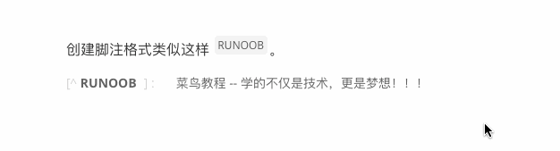
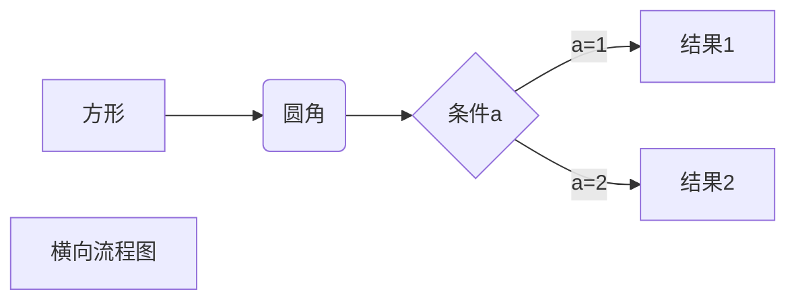
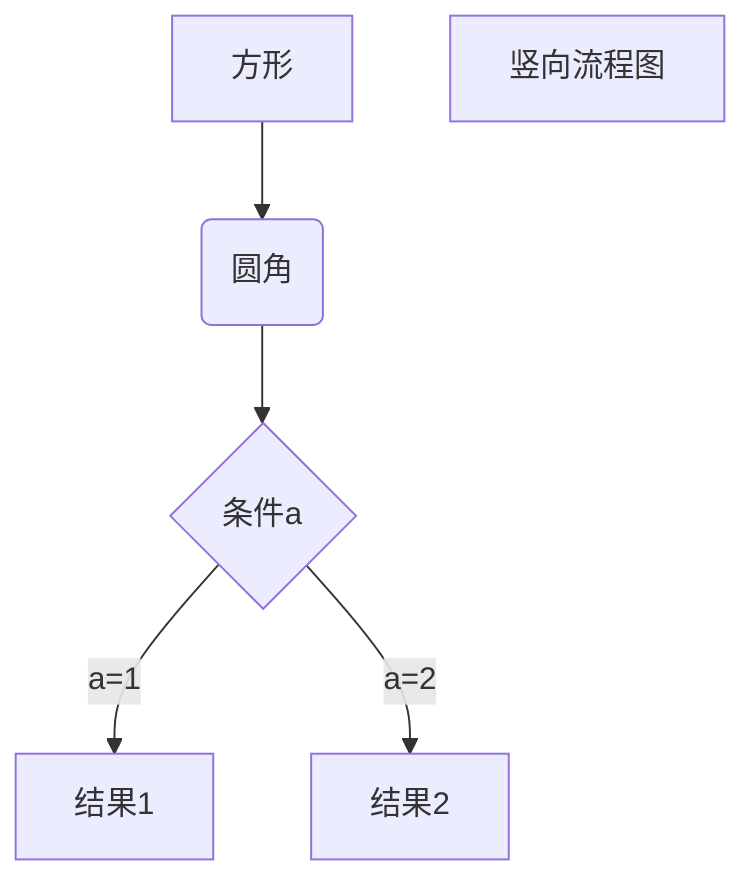
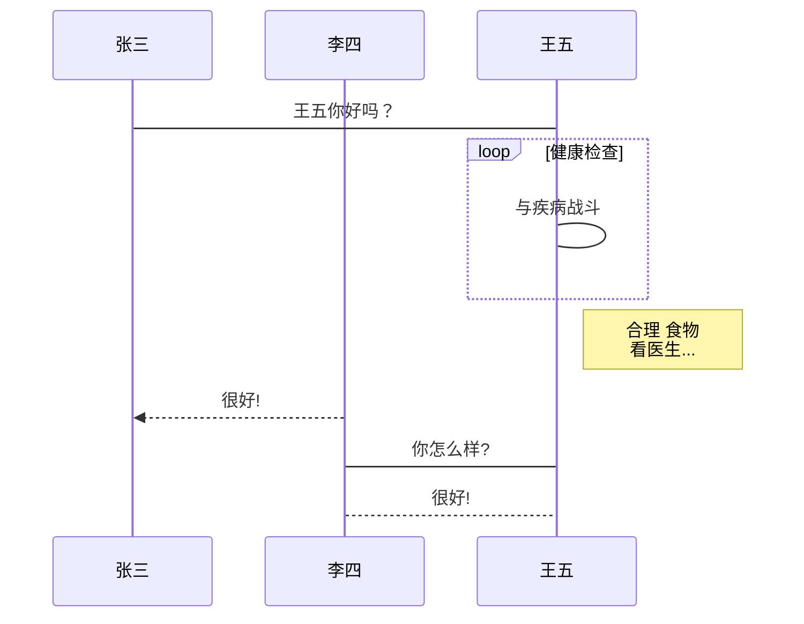
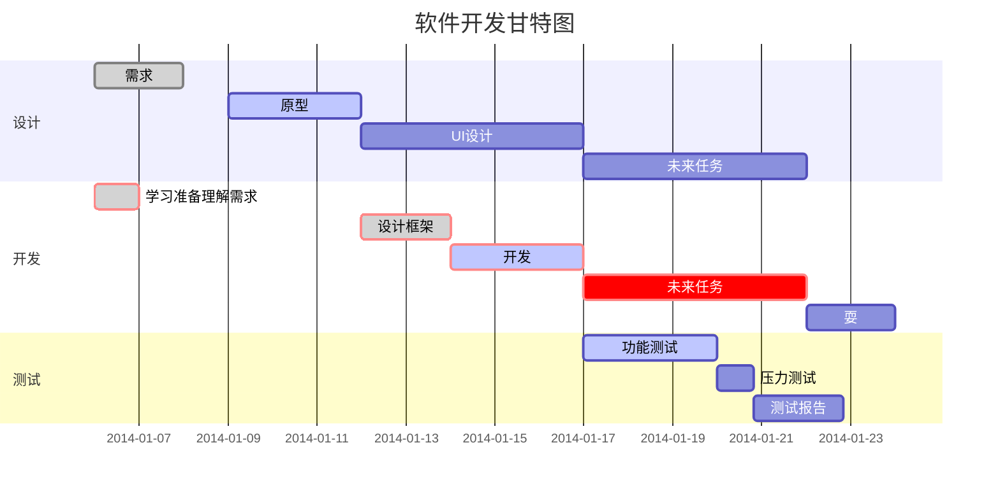

# Markdown 教程

## Markdown是什么
Markdown 是一种轻量级标记语言，它允许人们使用易读易写的纯文本格式编写文档。

Markdown 语言在 2004 由约翰·格鲁伯（英语：John Gruber）创建。

Markdown 编写的文档可以导出 HTML 、Word、图像、PDF、Epub 等多种格式的文档。

Markdown 编写的文档后缀为 .md, .markdown。
## Markdown应用
Markdown 能被使用来撰写电子书，如：Gitbook。

当前许多网站都广泛使用 Markdown 来撰写帮助文档或是用于论坛上发表消息。例如：GitHub、简书、reddit、Diaspora、Stack Exchange、OpenStreetMap 、SourceForge等。

## 编辑器
### Typora
Typora 是一款流行的 Markdown 编辑器，适用于 Windows、macOS 和 Linux 操作系统。它提供了一个直观的用户界面，允许用户在无需掌握大量 Markdown 语法的情况下编写结构化的文档。


即时预览：不同于其他 Markdown 编辑器，Typora 提供了所见即所得（WYSIWYG）的编辑体验，所有的格式都是实时渲染的，使得阅读和写作更加流畅。

简洁的界面：没有多余的工具栏或按钮，保持了界面的干净和简单，让用户专注于内容创作。

丰富的格式支持：除了标准的 Markdown 语法外，Typora 还支持自定义 CSS、数学公式、表格、代码块高亮等。

文件管理：内置文件浏览器可以帮助用户轻松管理和打开本地文件。

导出选项：可以将文档导出为 PDF、Word、HTML 等多种格式。

插件支持：通过使用社区开发的插件来扩展功能。

___Typora___ 官网地址 ：https://www.typora.io/
### VSCode 
VSCode编辑器可以编辑 Markdown 的语法，VSCode 支持 MacOS 、Windows、Linux 平台，且包含多种主题。

VSCode 默认集成了 Markdown 文档编辑插件，原生就支持高亮 Markdown 的语法。

VSCode（全称：Visual Studio Code）是一款由微软开发且跨平台的免费源代码编辑器。
___VScode 安装教程___ : https://www.runoob.com/w3cnote/vscode-tutorial.html

___VScode 官网地址___ : https://code.visualstudio.com/
 
 ### MarkText
MarkText -- 简单而优雅的开源 Markdown 编辑器

支持平台： Linux, macOS 以及 Windows

___Github 开源地址___： https://github.com/marktext/marktext

___官网地址___ ： https://www.marktext.cc/


## 推荐书籍（仅作推荐
《了不起的Markdown》


## Markdown语法教程

### Markdown标题
Markdown 标题有两种格式。
1. = 和 - 标记一级和二级标题
2. 使用 # 号标记

__= 和 - 标记语法格式如下：__
```
我展示的是一级标题
=================

我展示的是二级标题
-----------------
```
__使用 # 号标记：__

使用 # 号可表示 1-6 级标题，一级标题对应一个 # 号，二级标题对应两个 # 号，以此类推。
```
# 一级标题
## 二级标题
### 三级标题
#### 四级标题
##### 五级标题
###### 六级标题
```
### Markdown段落格式
#### 段落
Markdown 段落没有特殊的格式，直接编写文字就好，段落的换行是使用两个以上空格加上回车。
```
两种换行模式：
abcd  //在末尾添加两个空格表示换行
abcd


abcd

//使用空行来表示换行
abcd
```

***<u>因vitepress会使用反射读取md实时渲染造成文档阅读体验不好，故不展示效果</u>***

#### 字体
Markdown 中使用 _ 或 * 包裹文字，来表示字体样式，可以使用以下几种字体。
```
//字体样式：

*斜体文本*
_斜体文本_
**粗体文本**
__粗体文本__
***粗斜体文本***
___粗斜体文本___
```
效果如下：

* _

*斜体文本*

_斜体文本_

**   _ _


**粗体文本**

__粗体文本__

*** _ _ _
 
***粗斜体文本***

___粗斜体文本___

#### 分隔线
你可以在一行中用三个以上的星号、减号、底线来建立一个分隔线，行内不能有其他东西。你也可以在星号或是减号中间插入空格。下面每种写法都可以建立分隔线。
```
//分隔符语法：

***

* * *

*****

- - -

----------
```
效果如下：
***

* * *

*****

- - -

----------
#### 删除线
如果段落上的文字要添加删除线，只需要在文字的两端加上两个波浪线 ~~ 即可，实例如下。
```
java
python
~~C++~~
```
效果如下：

Java

Python

~~C++~~

#### 下划线
下划线可以通过 HTML 的 ``<u>`` 标签来实现：

```
<u>带下划线文本</u>
```
效果如下：

<u>带下划线文本</u>

#### 脚注
脚注是对文本的补充说明。

Markdown 脚注的格式如下:
```
[^要注明的文本]

创建脚注格式类似这样 [^Java是全世界最好的语言]。

[^Java是全世界最好的语言]: Php才是！！！


//脚注理解:

这是带有脚注的句子[^example]。

[^example]: 这是脚注的具体内容。你可以在脚注中提供额外的信息或解释。
```
效果如下：（Markdown（MD）文档的脚注功能并不是所有Markdown解析器都默认支持的，因此有些浏览器无法看到效果）



### Markdown 列表
Markdown 支持有序列表和无序列表。

#### 无序列表
无序列表使用星号(*)、加号(+)或是减号(-)作为列表标记，这些标记后面要添加一个空格，然后再填写内容。
```
* 第一项
* 第二项
* 第三项

+ 第一项
+ 第二项
+ 第三项


- 第一项
- 第二项
- 第三项
```
效果如下：
* 第一项
* 第二项
* 第三项

+ 第一项
+ 第二项
+ 第三项


- 第一项
- 第二项
- 第三项

#### 有序列表
有序列表使用数字并加上 . 号来表示。
```
1. 第一项
2. 第二项
3. 第三项
```
效果如下：

1. 第一项
2. 第二项
3. 第三项

#### 列表嵌套
列表嵌套只需在子列表中的选项前面添加两个或四个空格即可。
```
1. 第一项：
    - 第一项嵌套的第一个元素
    - 第一项嵌套的第二个元素
2. 第二项：
    - 第二项嵌套的第一个元素
    - 第二项嵌套的第二个元素
```
效果如下：

1. 第一项：
    - 第一项嵌套的第一个元素
    - 第一项嵌套的第二个元素
2. 第二项：
    - 第二项嵌套的第一个元素
    - 第二项嵌套的第二个元素

### Markdown 区块
#### 普通区块
Markdown 区块引用是在段落开头使用 > 符号 ，然后后面紧跟一个**空格**符号。
```
> 区块引用
> 菜鸟教程
> 学的不仅是技术更是梦想
```
效果如下：
> 区块引用

> 菜鸟教程

> 学的不仅是技术更是梦想

#### 嵌套区块
区块是可以嵌套的，一个 > 符号是最外层，两个 > 符号是第一层嵌套，以此类推。
```
> 最外层
> > 第一层嵌套
> > > 第二层嵌套
```
效果如下：

> 最外层
> > 第一层嵌套
> > > 第二层嵌套

#### 区块与列表结合
**区块中使用列表**

区块中使用列表实例如下。
```
> 区块中使用列表
> 1. 第一项
> 2. 第二项
> + 第一项
> + 第二项
> + 第三项
```
效果如下：
> 区块中使用列表
> 1. 第一项
> 2. 第二项
> + 第一项
> + 第二项
> + 第三项

**列表中使用区块**
```
* 第一项
    > 成都东软学院
    >> 移动创新实验室
* 第二项
    > 腾讯

    > 百度
```
* 第一项
    > 成都东软学院
    >> 移动创新实验室
* 第二项
    > 腾讯

    > 百度

### Markdown 代码
#### Markdown 代码
如果是段落上的一个函数或片段的代码可以用反引号把它包起来（`），例如。
```
`printf()` 函数
`console.log('这是一个彩蛋')`
```
效果如下：

`printf()` 函数
#### 代码区块
代码区块使用 4 个空格或者一个制表符（Tab 键）。
```
  public class HelloWorld {
    public static void main(String[] args) {
        System.out.println("Hello, World!");
    }
}
```
效果如下：
>public class HelloWorld {
>  
>    public static void main(String[] args) {
>
>        System.out.println("Hello, World!");
>     }
>}

也可以用 ``` 包裹一段代码，并指定一种语言（也可以不指定）。

```javascript
$(document).ready(function () {
    alert('移动创新实验室');
});
```
效果如上：（文档的代码演示均为```实现）

### Markdown 链接
链接使用方法如下
```
[链接名称](链接地址)

或者

<链接地址>

```
这是一个链接 [菜鸟教程](https://www.runoob.com)

这是一个链接 [billbill](https://www.bilibili.com/)

<https://www.baidu.com>

#### 高级链接
可以通过变量来设置一个链接，变量赋值在文档末尾进行
```
这个链接用 1 作为网址变量 [百度][1]

然后在文档的结尾为变量赋值（网址）

  [1]: http://www.baidu.com/

  ```
  这个链接用 1 作为网址变量 [百度][1]

然后在文档的结尾为变量赋值（网址）

  [1]: http://www.baidu.com/

理解为  ``[1]: http://www.baidu.com/`` `` [1]``作为[百度]的值

### Markdown 图片
#### 图片格式
Markdown 图片语法格式如下

开头一个感叹号 !

接着一个方括号，里面放上图片的替代文字

接着一个普通括号，里面放上图片的网址，最后还可以用引号包住并加上选择性的 'title' 属性的文字。
```


//[alt 属性文本]作用是图片显示错误时展示的默认内容
```
图一


图二


图三


#### 网络图片
当然，你也可以像网址那样对图片网址使用变量
```
这个链接用 1 作为网址变量 [网络图片][2].
然后在文档的结尾为变量赋值（网址）

[2]:https://images.pexels.com/photos/30142098/pexels-photo-30142098.jpeg?auto=compress&cs=tinysrgb&w=1260&h=750&dpr=1
图片来自网络，本图片仅供学习交流使用，如有侵权，请联系删除。
```
效果如下：

这个链接用 2 作为网址变量 [网络图片][2].

然后在文档的结尾为变量赋值（网址）

[2]: https://images.pexels.com/photos/30142098/pexels-photo-30142098.jpeg?auto=compress&cs=tinysrgb&w=1260&h=750&dpr=1
#### Markdown 使用html标签
如果你需要的话，你可以使用普通的 ```` 标签。
```

```


### Markdown 表格
#### 表格使用
Markdown 制作表格使用 | 来分隔不同的单元格，使用 - 来分隔表头和其他行。
```
|  表头   | 表头  |
|  ----  | ----  |
| 单元格  | 单元格 |
| 单元格  | 单元格 |
```
效果如下：
|  表头   | 表头  |
|  ----  | ----  |
| 单元格  | 单元格 |
| 单元格  | 单元格 |
#### 表格对齐 
-: 设置内容和标题栏居右对齐。

:- 设置内容和标题栏居左对齐。

:-: 设置内容和标题栏居中对齐。
```
| 左对齐 | 右对齐 | 居中对齐 |
| :-----| ----: | :----: |
| 单元格 | 单元格 | 单元格 |
| 单元格 | 单元格 | 单元格 |
```
效果如下：
| 左对齐 | 右对齐 | 居中对齐 |
| :-----| ----: | :----: |
| 单元格 | 单元格 | 单元格 |
| 单元格 | 单元格 | 单元格 |

### Markdown 高级技巧
#### 支持 HTML 元素
不在 Markdown 涵盖范围之内的标签，都可以直接在文档里面用 HTML 撰写。

目前支持的 HTML 元素有：``<kbd> <b> <i> <em> <sup> <sub> <br>``等 。
```
使用 <kbd>Ctrl</kbd>+<kbd>Alt</kbd>+<kbd>Del</kbd> 重启电脑
```
效果如下：
使用 <kbd>Ctrl</kbd>+<kbd>Alt</kbd>+<kbd>Del</kbd> 重启电脑

#### 转义
Markdown 使用了很多特殊符号来表示特定的意义，如果需要显示特定的符号则需要使用转义字符，Markdown 使用反斜杠转义特殊字。解决了md语法中样式冲突问题。
```
**文本加粗** 
\*\* 正常显示星号 \*\*
```
效果如下：

**文本加粗** 

\*\* 正常显示星号 \*\*

其余特殊字符
```
\   反斜线
`   反引号
*   星号
_   下划线
{}  花括号
[]  方括号
()  小括号
#   井字号
+   加号
-   减号
.   英文句点
!   感叹号
```
未经过转义效果：

\   反斜线
`   反引号
*   星号
_   下划线
{}  花括号
[]  方括号
()  小括号
#   井字号
+   加号
-   减号
.   英文句点
!   感叹号

### Typora 拓展
复制以下代码使用 typora 的源码模式粘贴到编辑器中便可查看效果
#### 横向流程图

#### 竖向流程图

#### 标准流程图
```flow
st=>start: 开始框
op=>operation: 处理框
cond=>condition: 判断框(是或否?)
sub1=>subroutine: 子流程
io=>inputoutput: 输入输出框
e=>end: 结束框
st->op->cond
cond(yes)->io->e
cond(no)->sub1(right)->op
```
##### 标准流程图（横向）
```flow
st=>start: 开始框
op=>operation: 处理框
cond=>condition: 判断框(是或否?)
sub1=>subroutine: 子流程
io=>inputoutput: 输入输出框
e=>end: 结束框
st(right)->op(right)->cond
cond(yes)->io(bottom)->e
cond(no)->sub1(right)->op
```
#### UML时序图
```sequence
对象A->对象B: 对象B你好吗?（请求）
Note right of 对象B: 对象B的描述
Note left of 对象A: 对象A的描述(提示)
对象B-->对象A: 我很好(响应)
对象A->对象B: 你真的好吗？
```
##### UML时序图源码复杂样例
```sequence
Title: 标题：复杂使用
对象A->对象B: 对象B你好吗?（请求）
Note right of 对象B: 对象B的描述
Note left of 对象A: 对象A的描述(提示)
对象B-->对象A: 我很好(响应)
对象B->小三: 你好吗
小三-->>对象A: 对象B找我了
对象A->对象B: 你真的好吗？
Note over 小三,对象B: 我们是朋友
participant C
Note right of C: 没人陪我玩
```
##### UML标准时序图样例

#### 甘特图
