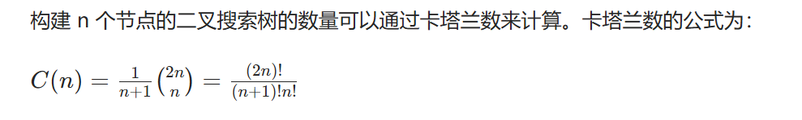

#  面经1
根据网上面经，问题回答
## 1.询问使用的语言，对TS了解程度；
TypeScript 是 JavaScript 的超集，增加了类型系统和编译时检查。它的主要特点包括：

静态类型：可以定义变量的类型，减少运行时错误。
接口和类：支持面向对象编程，增强代码可读性和可维护性。
工具支持：有更好的 IDE 支持，提供代码补全和重构功能。
## 2.介绍一下Promise，Promise对象有几种状态以及相关函数；
Promise 是一种用于处理异步操作的对象。它有三种状态：

Pending（待定）：初始状态，既不是成功也不是失败。
Fulfilled（已兑现）：操作成功完成。
Rejected（已拒绝）：操作失败。
相关函数：

then(onFulfilled, onRejected)：处理成功或失败的回调。
catch(onRejected)：处理失败的回调。
finally(onFinally)：无论成功或失败都会执行的回调。
## 3.简单说说vue的父子组件之间的通信方式；
props：父组件通过 props 向子组件传递数据。
$emit：子组件通过 $emit 向父组件发送事件。
Vuex：使用 Vuex 进行状态管理，多个组件共享状态。
## 4.vue中，设置data之后是什么样的；
在 Vue 中，设置 data 后，Vue 会将其转换为响应式对象。任何对 data 的修改都会触发视图更新。
## 5.刚才提到Vuex，简单介绍一下；
Vuex 是 Vue.js 的状态管理模式，提供集中式存储管理应用的所有组件的状态。主要特点包括：

State：存储状态。
Getters：计算属性，基于 state 计算派生状态。
Mutations：同步修改状态的方法。
Actions：异步操作，可以提交 mutations。
## 6.存储方式有哪些，Vuex相比于这几种存储方式有什么特点；
常见的存储方式包括：

LocalStorage：浏览器本地存储，简单易用。
SessionStorage：会话存储，数据在会话结束后失效。
Cookies：小型数据存储，适合存储少量信息。

Vuex 的特点：

集中式管理，便于调试和维护。
响应式，状态变化自动更新视图。
## 7.说说浏览器发送URL的过程；
DNS 查询：解析域名为 IP 地址。
建立 TCP 连接：通过三次握手建立连接。
发送 HTTP 请求：浏览器发送请求到服务器。
服务器响应：返回请求的资源。
关闭连接：通过四次挥手关闭连接。

## 8.说一说强缓存与协商缓存，是怎么使用的；
强缓存：在有效期内直接使用缓存，不发请求。通过 Cache-Control 和 Expires 控制。
协商缓存：请求时向服务器验证缓存有效性。通过 Last-Modified 和 ETag 实现。
## 9.了解过跨域吗，如何解决跨域问题的；
跨域是指不同源之间的请求。解决方案包括：

CORS：服务器设置响应头允许跨域。

JSONP：通过```<script>```标签请求数据。
代理：使用同源的服务器作为中介。
## 10.get请求和post请求有什么区别；
GET：用于获取数据，参数在 URL 中，数据量有限，不安全。
POST：用于提交数据，参数在请求体中，数据量大，更安全。
## 11.介绍一下死锁产生的原因，以及如何避免死锁；
死锁是指两个或多个进程相互等待对方释放资源。产生原因：

互斥：资源不能共享。
占有且等待：进程持有资源并等待其他资源。
不可抢占：资源不能被强行夺走。
循环等待：形成环形等待。

避免方法：

资源分配图：使用资源分配图避免循环等待。
请求顺序：规定资源请求的顺序。
## 12.了解过最小堆吗，简单说说如何实现；
最小堆是一种完全二叉树，父节点小于子节点。可以使用数组实现：
```js
class MinHeap {
    constructor() {
        this.heap = [];
    }

    insert(value) {
        this.heap.push(value);
        this.bubbleUp();
    }

    bubbleUp() {
        // 实现上浮操作
    }
}

```
## 13.介绍一下常见的排序算法以及它们的时间复杂度；
冒泡排序：O(n^2)
选择排序：O(n^2)
插入排序：O(n^2)
快速排序：O(n log n)
归并排序：O(n log n)
堆排序：O(n log n)
## 14.在尽可能短的时间内找到无序数组中最大的K个数（提到了大根堆，时间复杂度是多少）；
使用大根堆可以高效找到最大的 K 个数，时间复杂度为 O(n log k)。
## 15.手撕题：给一个数字n，能够构建多少个二叉搜索树；


下面是用 JavaScript 实现的代码：
```js
function factorial(num) {
    if (num === 0 || num === 1) return 1;
    let result = 1;
    for (let i = 2; i <= num; i++) {
        result *= i;
    }
    return result;
}

function numTrees(n) {
    return factorial(2 * n) / (factorial(n + 1) * factorial(n));
}

// 示例
console.log(numTrees(3)); // 输出: 5

```
## 16.手撕题：重排链表；
重排链表的要求是将链表的节点按照特定顺序重新排列。具体步骤如下：

 1. 找到链表的中间节点。
 2. 反转后半部分链表。
 3. 交替合并前半部分和反转后的后半部分。


以下是实现重排链表的详细代码：

```js
class ListNode {
    constructor(value = 0, next = null) {
        this.value = value;
        this.next = next;
    }
}

function reorderList(head) {
    if (!head || !head.next) return;

    // 1. 找到中点
    let slow = head;
    let fast = head;
    while (fast && fast.next) {
        slow = slow.next;
        fast = fast.next.next;
    }

    // 2. 反转后半部分链表
    let prev = null;
    let curr = slow;
    while (curr) {
        const nextTemp = curr.next;
        curr.next = prev;
        prev = curr;
        curr = nextTemp;
    }

    // 3. 交替合并前半部分和反转后的后半部分
    let first = head;
    let second = prev; // 反转后的链表头
    while (second.next) {
        const temp1 = first.next;
        const temp2 = second.next;

        first.next = second;
        second.next = temp1;

        first = temp1;
        second = temp2;
    }
}

// 示例用法
let head = new ListNode(1, new ListNode(2, new ListNode(3, new ListNode(4))));
reorderList(head);

// 打印重排后的链表
let current = head;
while (current) {
    console.log(current.value); // 输出: 1, 4, 2, 3
    current = current.next;
}

```

## 2-补充
### ts
<h4>TypeScript 介绍:</h4>

TypeScript（TS）是由 微软 开发的一种编程语言，它是 JavaScript 的一个超集，主要用于增强 JavaScript 的功能。

<h4>TypeScript 的作用:</h4>

<h5>类型安全</h5>通过静态类型检查，帮助开发者在编译阶段捕捉错误，减少运行时错误。

<h5>增强的开发体验</h5>提供更好的 IDE 支持，包括代码补全、重构和导航功能，提高开发效率。

<h5>可维护性</h5>通过类型定义和接口，增强代码的可读性和可维护性，特别是在大型项目中。

<h5>静态类型</h5>可以定义变量的类型，减少运行时错误。

<h5>接口和类</h5>支持面向对象编程，增强代码可读性和可维护性。

<h5>工具支持</h5>有更好的 IDE 支持，提供代码补全和重构功能。
<h4>TypeScript 的特性</h4>
<h5>静态类型</h5>
允许开发者为变量、函数参数和返回值定义类型。
支持基本类型（如 string、number、boolean）和复杂类型（如 arrays、tuples、enums）。
<h5>接口（Interfaces</h5>

可以定义对象的结构，强制实现特定的属性和方法，提高代码的一致性。
<h5>类（Classes）</h5>

支持基于类的面向对象编程，包括继承、封装和多态。
<h5>模块化（Modules）</h5>

支持 ES6 模块语法，允许将代码分割成不同的文件，提高代码的组织性。
<h5>泛型（Generics）</h5>

允许创建可重用的组件，支持多种数据类型，增强代码的灵活性。
<h5>类型推断（Type Inference）</h5>

TypeScript 能够根据上下文自动推断变量的类型，减少显式类型声明的需要。
<h5>装饰器（Decorators）（实验性特性）</h5>

提供了一种修改类和类成员的方式，常用于 Angular 等框架中。
<h4>开发带来的优势</h4>
提高代码质量：通过类型检查和接口定义，减少了潜在的错误，提高了代码的可靠性。
增强团队协作：在团队开发中，明确的类型定义和接口可以帮助开发者更好地理解和使用代码。
更好的文档：类型和接口的定义可以作为代码的自我文档，减少外部文档的需求。
兼容性：TypeScript 可以编译成标准的 JavaScript，支持所有浏览器和环境。
## 讲讲深拷贝和浅拷贝的区别，如何实现深拷贝；
浅拷贝：复制对象的第一层属性，嵌套对象仍然引用原对象。
深拷贝：递归复制对象及其所有嵌套对象，创建完全独立的副本。
实现深拷贝的方式：

```js
function deepClone(obj) {
    return JSON.parse(JSON.stringify(obj));
}

JSON.parse(JSON.stringify(obj))
```

